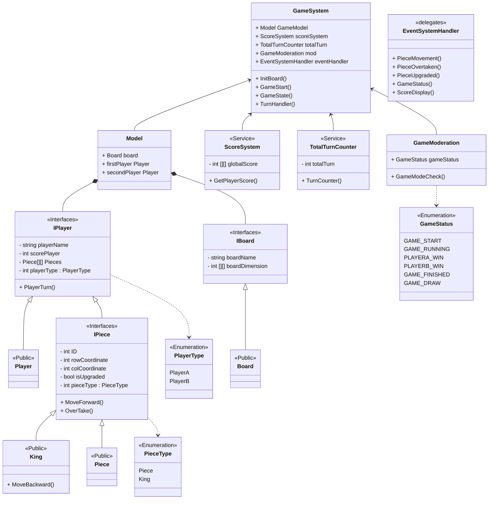

```mermaid
classDiagram
    %% OOP Structure

    %% Big Parent Class inherit Interface
    IPiece <|-- King
    IPiece <|-- Piece
    IPlayer <|-- Player
    IPlayer <|-- IPiece
    IBoard <|-- Board

    %% Instantiating Class Relation
    Model *-- IPlayer
    Model *-- IBoard

    %% Relation to GameSystem
    GameSystem <-- Model
    GameSystem <-- ScoreSystem
    GameSystem <-- TotalTurnCounter
    GameSystem <-- GameModeration

    %% Enumeration Relation to Class
    IPlayer ..> PlayerType 
    IPiece ..> PieceType
    GameModeration ..> GameStatus

    %% MAIN PROGRAM/GAME CONTROLLER
    class Model{
      + Board board
      + firstPlayer Player
      + secondPlayer Player
    }
    class GameSystem{
      + Model GameModel
      + ScoreSystem scoreSystem
      + TotalTurnCounter totalTurn
      + GameModeration mod
      + EventSystemHandler eventHandler
      + InitBoard()
      + GameStart()
      + GameState()
      + TurnHandler()
    }

    class GameModeration{
      + GameStatus gameStatus
      + GameModeCheck()
    }

    %% Defining Interface
    class IPiece{
      <<Interfaces>>
      - int ID
      - int rowCoordinate
      - int colCoordinate
      - bool isUpgraded
      - int pieceType : PieceType
      + MoveForward()
      + OverTake()
    }

    class IPlayer{
      <<Interfaces>>
      - string playerName
      - int scorePlayer
      - Piece[][] Pieces
      - int playerType : PlayerType
      + PlayerTurn()
    }

    class IBoard{
      <<Interfaces>>
      - string boardName
      - int [][] boardDimension
    }

    %% Defining Class Template
    class Piece{
      <<Public>>
    }
    class King{
      <<Public>>
      + MoveBackward()
    }

    class Player{
      <<Public>>
    }

    class Board{
      <<Public>>
    }

    %% Defining Services
    class ScoreSystem{
      <<Service>>
      - int [][] globalScore
      + GetPlayerScore()
    }

    class TotalTurnCounter{
      <<Service>>
      - int totalTurn
      + TurnCounter()
    }

    %% Defining Event Handler Delegates
    class EventSystemHandler{
      <<delegates>>
      + PieceMovement()
      + PieceOvertaken()
      + PieceUpgraded()
      + GameStatus()
      + ScoreDisplay()
    }

    %% Defining Enums//Game Status
    class GameStatus{
      <<Enumeration>>
      GAME_START
      GAME_RUNNING
      PLAYERA_WIN
      PLAYERB_WIN
      GAME_FINISHED
      GAME_DRAW
    }
    class PlayerType{
      <<Enumeration>>
      PlayerA
      PlayerB
    }
    
    class PieceType{
      <<Enumeration>>
      Piece
      King
    }
```