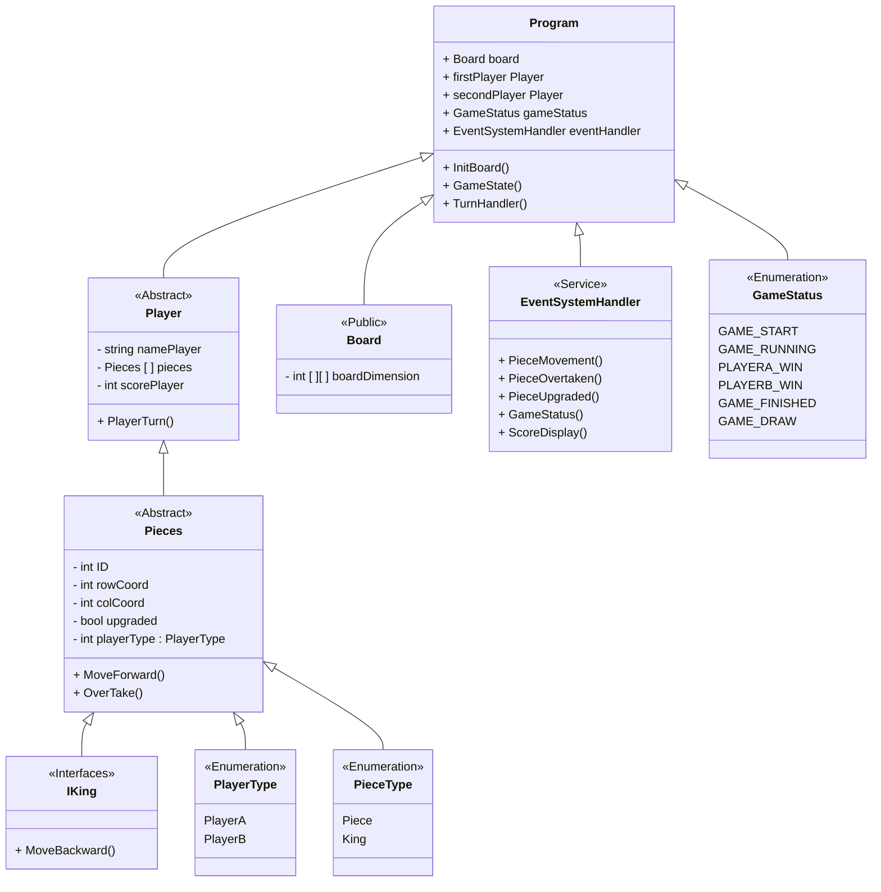

```mermaid
classDiagram
    %% OOP Structure
    Pieces <|-- IKing
    Player <|-- Pieces
    Program <|-- Player
    Program <|-- Board
    Program <|-- EventSystemHandler
    Program <|-- GameStatus
    Pieces <|-- PlayerType 
    Pieces <|-- PieceType 
    


    %% MAIN PROGRAM/GAME CONTROLLER
    class Program{
      + Board board
      + firstPlayer Player
      + secondPlayer Player
      + GameStatus gameStatus
      + EventSystemHandler eventHandler
      + InitBoard()
      + GameState()
      + TurnHandler()

    }

    %% Defining Abstract Class Template
    class Pieces{
      <<Abstract>>
      - int ID
      - int rowCoord
      - int colCoord
      - bool upgraded
      - int playerType : PlayerType
      + MoveForward()
      + OverTake()
    }
    class Player{
      <<Abstract>>
      - string namePlayer
      - Pieces [ ] pieces
      - int scorePlayer
      + PlayerTurn()  
    }

    class Board{
      <<Public>>
      - int [ ][ ] boardDimension


    }

    %% Defining Interface
    class IKing{
      <<Interfaces>>
      + MoveBackward()
    }

    %% Defining Event Handler
    class EventSystemHandler{
      <<Service>>
      + PieceMovement()
      + PieceOvertaken()
      + PieceUpgraded()
      + GameStatus()
      + ScoreDisplay()
    }

    %% Defining Enums//Game Status
    class GameStatus{
      <<Enumeration>>
      GAME_START
      GAME_RUNNING
      PLAYERA_WIN
      PLAYERB_WIN
      GAME_FINISHED
      GAME_DRAW
    }
    class PlayerType{
      <<Enumeration>>
      PlayerA
      PlayerB
    }
    
    class PieceType{
      <<Enumeration>>
      Piece
      King
    }
```