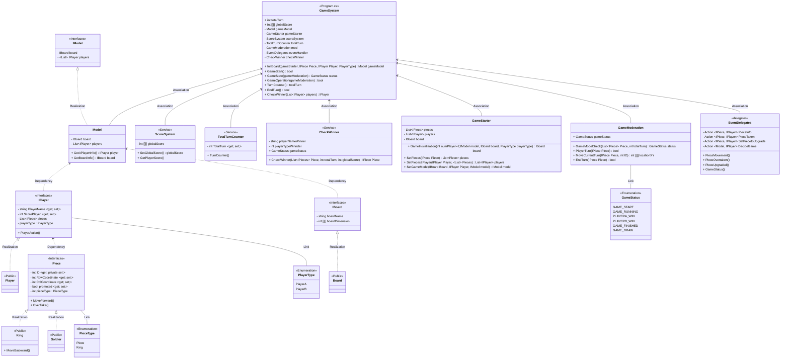

```mermaid
classDiagram
    %% OOP Structure

    %% Big Parent Class inherit Interface
    IPiece <|.. King : Realization
    IPiece <|.. Soldier : Realization
    IPlayer <|.. Player : Realization
    IPlayer <.. IPiece : Dependency
    IBoard <|.. Board : Realization
    IModel <|.. Model : Realization

    %% Instantiating Class Relation
    Model <.. IPlayer : Dependency
    Model <.. IBoard : Dependency

    %% Relation to GameSystem
    GameSystem <-- Model : Association
    GameSystem <-- ScoreSystem : Association
    GameSystem <-- TotalTurnCounter : Association
    GameSystem <-- CheckWinner : Association
    GameSystem <-- GameStarter : Association
    GameSystem <-- GameModeration : Association
    %% Delegates to the Main Program
    GameSystem <-- EventDelegates : Association

    %% Enumeration Relation to Class
    IPlayer -- PlayerType : Link
    IPiece -- PieceType : Link
    GameModeration -- GameStatus : Link


    %% MAIN PROGRAM/GAME CONTROLLER
    class Model{
      - IBoard board
      - List~IPlayer~ players
      + GetAPlayerInfo() IPlayer player
      + GetBoardInfo() IBoard board
    }

    class GameSystem{
      <<Program.cs>>
      + int totalTurn
      + int [][] globalScore
      - Model gameModel
      - GameStarter gameStarter
      - ScoreSystem scoreSystem
      - TotalTurnCounter totalTurn
      - GameModeration mod
      - EventDelegates eventHandler
      - CheckWinner checkWinner
      
      + InitBoard(gameStarter, IPiece Piece, IPlayer Player, PlayerType) Model gameModel
      + GameStart() bool
      + GameState(gameModeration) GameStatus status
      + GameOperation(gameModeration) bool
      + TurnCounter() totalTurn
      + EndTurn() bool   
      + CheckWinner(List~IPlayer~ players) IPlayer
    }

    class GameModeration{
      + GameStatus gameStatus
      + GameModeCheck(List~IPiece~ Piece, int totalTurn) GameStatus status
      + PlayerTurn(IPiece Piece) bool
      + MoveCurrentTurn(IPiece Piece, int ID) int [][] locationXY
      + EndTurn(IPiece Piece) bool
    }

    class GameStarter{
      - List~IPiece~ pieces
      - List~IPlayer~ players
      - IBoard board
      + GameInisialization(int numPlayer=2,IModel model, IBoard board, PlayerType playerType)  IBoard board
      + SetPieces(IPiece Piece) List~Piece~ pieces
      + SetPieces2Player(IPlayer Player, ~List~ Pieces) List~IPlayer~ players
      + SetGameModel(IBoard Board, IPlayer Player, IModel model) IModel model
    }

    %% Defining Interface
    class IPiece{
      <<Interfaces>>
      - int ID ~get; private set;~
      - int RowCoordinate ~get; set;~
      - int ColCoordinate ~get; set;~
      - bool promoted ~get; set;~
      - int pieceType : PieceType
      + MoveForward()
      + OverTake()
    }

    class IPlayer{
      <<Interfaces>>
      - string PlayerName ~get; set;~
      - int ScorePlayer ~get; set;~
      - List~IPiece~ pieces
      - playerType : PlayerType
      + PlayerAction()
    }

    class IBoard{
      <<Interfaces>>
      - string boardName
      - int [][] boardDimension
    }

    class IModel{
      <<Interfaces>>
      - IBoard board
      - ~List~ IPlayer players
    }
    
    %% Defining Class Template
    class Soldier{
      <<Public>>
    }
    class King{
      <<Public>>
      + MoveBackward()
    }

    class Player{
      <<Public>>
    }

    class Board{
      <<Public>>
    }

    %% Defining Services
    class ScoreSystem{
      <<Service>>
      - int [][] globalScore
      + SetGlobalScore() globalScore
      + GetPlayerScore()
    }

    class CheckWinner{
      <<Service>>
      - string playerNameWinner
      - int playerTypeWinnder
      + GameStatus gameStatus
      + CheckWinner(List~IPieces~ Piece, int totalTurn, int globalScore) IPiece Piece
    }

    class TotalTurnCounter{
      <<Service>>
      - int TotalTurn ~get; set;~
      + TurnCounter()
    }

    %% Defining Event Handler Delegates
    class EventDelegates{
      <<delegates>>
      - Action ~IPiece, IPlayer~ PieceInfo
      - Action ~IPiece, IPlayer~ PieceTaken
      - Action ~IPiece, IPlayer~ SetPiecetoUpgrade
      - Action ~Model, IPlayer~ DecideGame
      + PieceMovement()
      + PieceOvertaken()
      + PieceUpgraded()
      + GameStatus()
    }

    %% Defining Enums//Game Status
    class GameStatus{
      <<Enumeration>>
      GAME_START
      GAME_RUNNING
      PLAYERA_WIN
      PLAYERB_WIN
      GAME_FINISHED
      GAME_DRAW
    }
    class PlayerType{
      <<Enumeration>>
      PlayerA
      PlayerB
    }
    
    class PieceType{
      <<Enumeration>>
      Piece
      King
    }
```