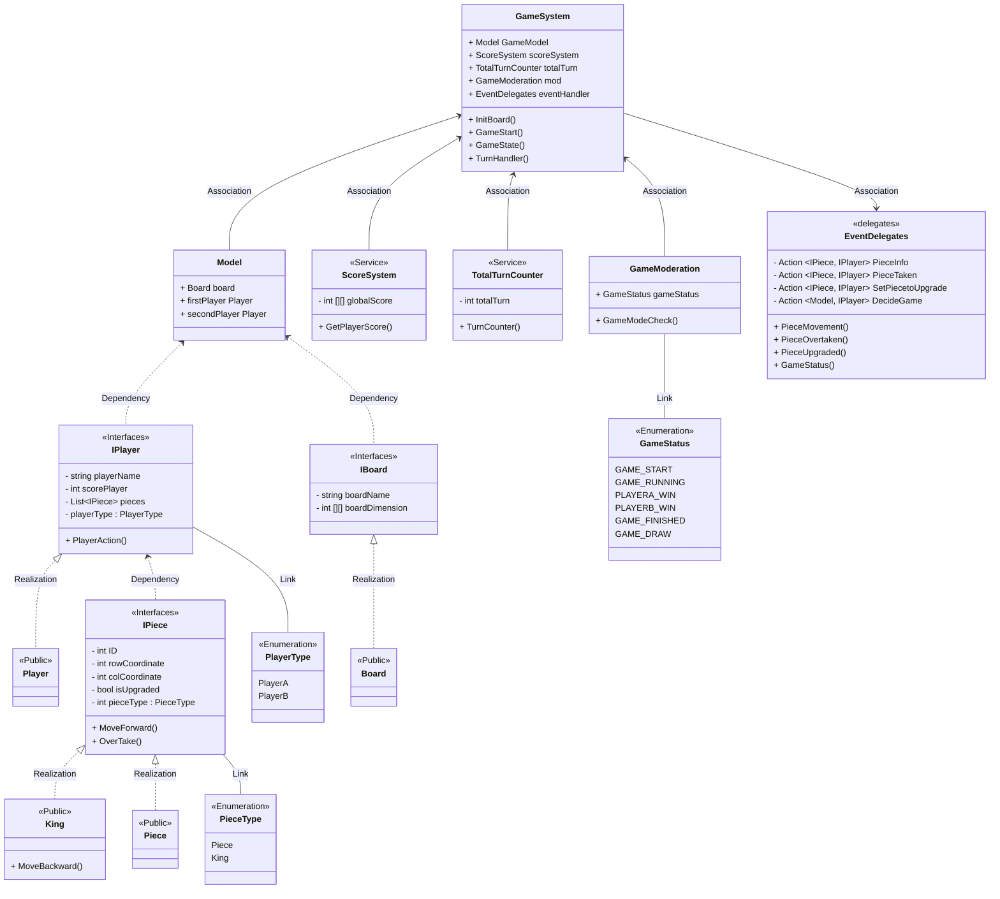

```mermaid
classDiagram
    %% OOP Structure

    %% Big Parent Class inherit Interface
    IPiece <|.. King : Realization
    IPiece <|.. Piece : Realization
    IPlayer <|.. Player : Realization
    IPlayer <.. IPiece : Dependency
    IBoard <|.. Board : Realization

    %% Instantiating Class Relation
    Model <.. IPlayer : Dependency
    Model <.. IBoard : Dependency

    %% Relation to GameSystem
    GameSystem <-- Model : Association
    GameSystem <-- ScoreSystem : Association
    GameSystem <-- TotalTurnCounter : Association
    GameSystem <-- GameModeration : Association
    %% Delegates to the Main Program
    GameSystem --> EventDelegates : Association

    %% Enumeration Relation to Class
    IPlayer -- PlayerType : Link
    IPiece -- PieceType : Link
    GameModeration -- GameStatus : Link


    %% MAIN PROGRAM/GAME CONTROLLER
    class Model{
      + Board board
      + firstPlayer Player
      + secondPlayer Player
    }
    class GameSystem{
      + Model GameModel
      + ScoreSystem scoreSystem
      + TotalTurnCounter totalTurn
      + GameModeration mod
      + EventDelegates eventHandler
      + InitBoard()
      + GameStart()
      + GameState()
      + TurnHandler()
    }

    class GameModeration{
      + GameStatus gameStatus
      + GameModeCheck()
    }

    %% Defining Interface
    class IPiece{
      <<Interfaces>>
      - int ID
      - int rowCoordinate
      - int colCoordinate
      - bool isUpgraded
      - int pieceType : PieceType
      + MoveForward()
      + OverTake()
    }

    class IPlayer{
      <<Interfaces>>
      - string playerName
      - int scorePlayer
      - List~IPiece~ pieces
      - playerType : PlayerType
      + PlayerAction()
    }

    class IBoard{
      <<Interfaces>>
      - string boardName
      - int [][] boardDimension
    }

    %% Defining Class Template
    class Piece{
      <<Public>>
    }
    class King{
      <<Public>>
      + MoveBackward()
    }

    class Player{
      <<Public>>
    }

    class Board{
      <<Public>>
    }

    %% Defining Services
    class ScoreSystem{
      <<Service>>
      - int [][] globalScore
      + GetPlayerScore()
    }

    class TotalTurnCounter{
      <<Service>>
      - int totalTurn
      + TurnCounter()
    }

    %% Defining Event Handler Delegates
    class EventDelegates{
      <<delegates>>
      - Action ~IPiece, IPlayer~ PieceInfo
      - Action ~IPiece, IPlayer~ PieceTaken
      - Action ~IPiece, IPlayer~ SetPiecetoUpgrade
      - Action ~Model, IPlayer~ DecideGame
      + PieceMovement()
      + PieceOvertaken()
      + PieceUpgraded()
      + GameStatus()
    }

    %% Defining Enums//Game Status
    class GameStatus{
      <<Enumeration>>
      GAME_START
      GAME_RUNNING
      PLAYERA_WIN
      PLAYERB_WIN
      GAME_FINISHED
      GAME_DRAW
    }
    class PlayerType{
      <<Enumeration>>
      PlayerA
      PlayerB
    }
    
    class PieceType{
      <<Enumeration>>
      Piece
      King
    }
```