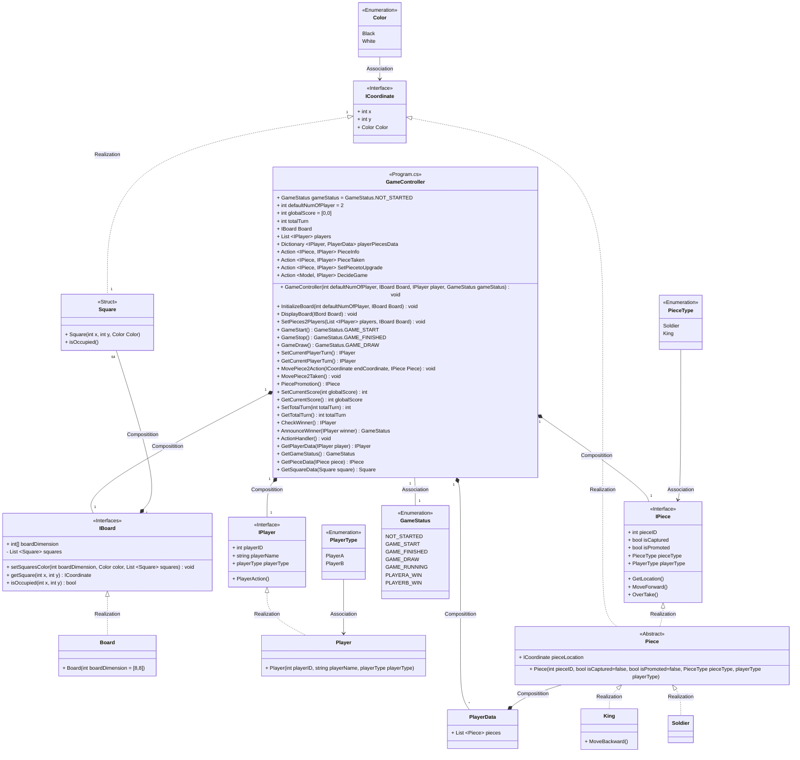

```mermaid
classDiagram
    %% OOP Structure %%
    %% Game Controller to All Components
    GameController "1" *-- "1" IBoard : Compositition 
    GameController "1" *-- "*" PlayerData : Compositition
    GameController "1" *-- "1" IPlayer : Compositition
    GameController "1" *-- "1" IPiece : Compositition
    GameController "1" -- "1" GameStatus : Association

    %% Board Relation
    IBoard <|.. Board : Realization
    ICoordinate "1" <|.. "1" Square : Realization
    Color --> ICoordinate : Association
    Square "64" --* "1" IBoard : Compositition

    %% Player Relation
    IPlayer <|.. Player : Realization
    PlayerType --> Player : Association
    Piece --* PlayerData : Compositition

    %% Piece Relation
    ICoordinate <|.. Piece : Realization
    IPiece <|.. Piece : Realization
    Piece <|.. King : Realization
    Piece <|.. Soldier : Realization
    PieceType --> IPiece : Association
    

    %% System Controller
    class GameController{
      <<Program.cs>>
      %% Initialize field
      + GameStatus gameStatus = GameStatus.NOT_STARTED
      + int defaultNumOfPlayer = 2
      + int globalScore = [0,0]
      + int totalTurn
      + IBoard Board
      + List ~IPlayer~ players
      + Dictionary ~IPlayer, PlayerData~ playerPiecesData
      %% Delegates and Action
      + Action ~IPiece, IPlayer~ PieceInfo
      + Action ~IPiece, IPlayer~ PieceTaken
      + Action ~IPiece, IPlayer~ SetPiecetoUpgrade
      + Action ~Model, IPlayer~ DecideGame

      %% Method of Game System
      + GameController(int defaultNumOfPlayer, IBoard Board, IPlayer player, GameStatus gameStatus) void
      + InitializeBoard(int defaultNumOfPlayer, IBoard Board) void
      + DisplayBoard(IBord Board) void
      + SetPieces2Players(List ~IPlayer~ players, IBoard Board) void
      + GameStart() GameStatus.GAME_START
      + GameStop() GameStatus.GAME_FINISHED
      + GameDraw() GameStatus.GAME_DRAW
      + SetCurrentPlayerTurn() IPlayer
      + GetCurrentPlayerTurn() IPlayer
      + MovePiece2Action(ICoordinate endCoordinate, IPiece Piece) void
      + MovePiece2Taken() void
      + PiecePromotion() IPiece
      + SetCurrentScore(int globalScore) int
      + GetCurrentScore() int globalScore
      + SetTotalTurn(int totalTurn) int 
      + GetTotalTurn() int totalTurn
      + CheckWinner() IPlayer
      + AnnounceWinner(IPlayer winner) GameStatus

      %% Method of Game Player Control
      + ActionHandler() void

      %% Method of Get State of anything
      + GetPlayerData(IPlayer player) IPlayer
      + GetGameStatus() GameStatus
      + GetPieceData(IPiece piece) IPiece
      + GetSquareData(Square square) Square

    }
    %% Components Pieces
    class IPiece{
      <<Interface>>
      + int pieceID
      + bool isCaptured
      + bool isPromoted
      + PieceType pieceType
      + PlayerType playerType
      + GetLocation()
      + MoveForward()
      + OverTake()
    }

    class Piece{
     <<Abstract>>
     + ICoordinate pieceLocation
     + Piece(int pieceID, bool isCaptured=false, bool isPromoted=false, PieceType pieceType, playerType playerType)
    }

    class Soldier{
    }

    class King{
     + MoveBackward()
    }

    %% Components Data Player
    class PlayerData{
     + List ~Piece~ pieces
    }

    %% Components Player
    class IPlayer{
      <<Interface>>
      + int playerID
      + string playerName
      + playerType playerType
      + PlayerAction()
    }

    class Player{
      + Player(int playerID, string playerName, playerType playerType)
    }

    %% Components Board
    %% Why each tiles/square is struct it's because all of them is immutable, so it's better to allocate struct into square data instead of class
    class Square{
      <<Struct>>
      + Square(int x, int y, Color Color)
      + isOccupied()
    }

    class ICoordinate{
     <<Interface>>
     + int x
     + int y
     + Color Color
    }

    class IBoard{
      <<Interfaces>>
      + int[] boardDimension
      - List ~Square~ squares
      + setSquaresColor(int boardDimension, Color color, List ~Square~ squares) void
      + getSquare(int x, int y) ICoordinate
      + isOccupied(int x, int y) bool
    }
    
    %% Class Object
    class Board{
     + Board(int boardDimension = [8,8])
    }

    %% Defining Enums//Game Status
    class PlayerType{
      <<Enumeration>>
      PlayerA
      PlayerB
    }
    
    class PieceType{
      <<Enumeration>>
      Soldier
      King
    }

    class Color{
      <<Enumeration>>
      Black
      White
    }

    class GameStatus{
      <<Enumeration>>
      NOT_STARTED
      GAME_START
      GAME_FINISHED
      GAME_DRAW
      GAME_RUNNING
      PLAYERA_WIN
      PLAYERB_WIN
    }

    
```