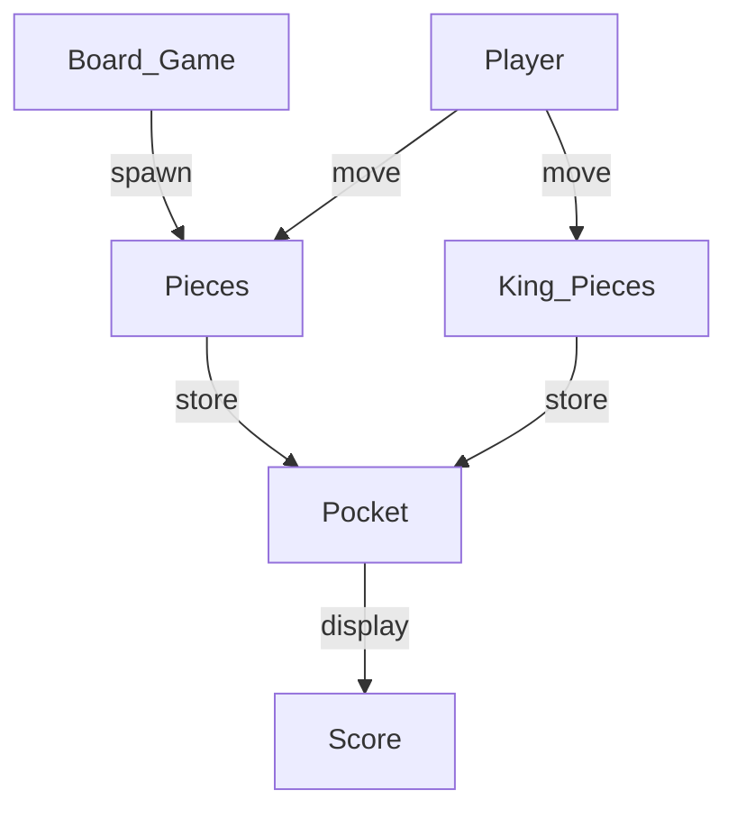

```mermaid
graph TD;
    Board_Game-- spawn -->Pieces;
    Player-- move -->Pieces;
    Player-- move -->King_Pieces;
    Pieces-- store -->Pocket;
    King_Pieces-- store -->Pocket;
    Pocket-- display -->Score;
```