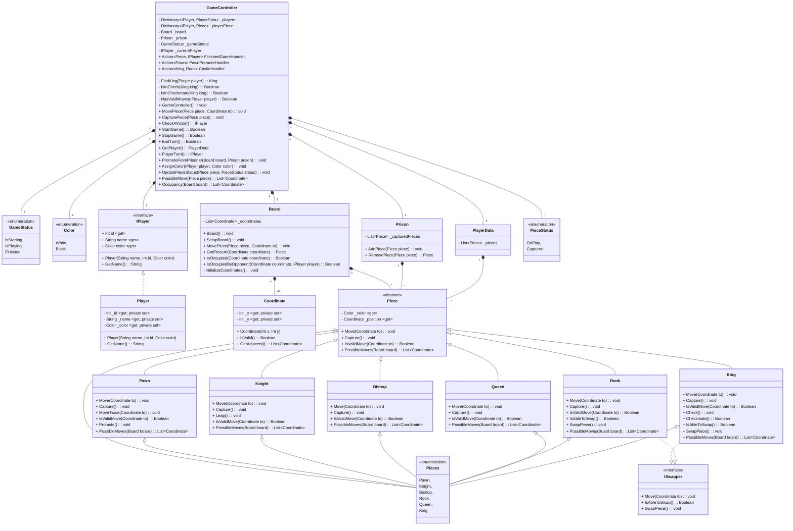

```mermaid
classDiagram
    class GameController {
        - Dictionary~IPlayer, PlayerData~ _players
        - Dictionary~IPlayer, Piece~ _playerPiece
        - Board _board
        - Prison _prison
        - GameStatus _gameStatus
        - IPlayer _currentPlayer
        - FindKing(Player player): King
        - IsInCheck(King king): Boolean
        - IsInCheckmate(King king): Boolean
        - HasValidMoves(IPlayer player): Boolean
        + Action~Piece, IPlayer~ FinishedGameHandler
        + Action~Pawn~ PawnPromoteHandler
        + Action~King, Rook~ CastleHandler
        + GameController(): void
        + MovePiece(Piece piece, Coordinate to): void
        + CapturePiece(Piece piece): void
        + CheckAVictor(): IPlayer
        + StartGame(): Boolean
        + StopGame(): Boolean
        + EndTurn(): Boolean
        + GetPlayer(): PlayerData
        + PlayerTurn(): IPlayer
        + PromoteFromPrisoner(Board board, Prison prison): void
        + AssignColor(IPlayer player, Color color): void
        + UpdatePieceStatus(Piece piece, PieceStatus status): void
        + PossibleMove(Piece piece): List~Coordinate~
        + Occupancy(Board board): List~Coordinate~
    }

    class GameStatus {
        <<enumeration>>
        IsStarting,
        IsPlaying,
        Finished
    }

    class Color {
        <<enumeration>>
        White,
        Black
    }

    class Player {
        - Int _id ~get; private set~
        - String _name ~get; private set~
        - Color _color ~get; private set~
        + Player(String name, Int id, Color color)
        + GetName(): String
    }

    class PlayerData {
        - List~Piece~ _pieces
    }

    class IPlayer {
        <<interface>>
        + Int id ~get~
        + String name ~get~
        + Color color ~get~
        + Player(String name, Int id, Color color)
        + GetName(): String
    }

    class Board {
        - List~Coordinate~ _coordinates
        + Board(): void
        + SetupBoard(): void
        + MovePiece(Piece piece, Coordinate to): void
        + GetPieceAt(Coordinate coordinate): Piece
        + IsOccupied(Coordinate coordinate): Boolean
        + IsOccupiedByOpponent(Coordinate coordinate, IPlayer player): Boolean
        - InitializeCoordinates(): void
    }

    class Coordinate {
        - Int _x ~get; private set~
        - Int _y ~get; private set~
        + Coordinate(Int x, Int y)
        + IsValid(): Boolean
        + GetAdjacent(): List~Coordinate~
    }

    class Prison {
        - List~Piece~ _capturedPieces
        + AddPiece(Piece piece): void
        + RemovePiece(Piece piece): Piece
    }

    class Piece {
        <<abstract>>
        - Color _color ~get~
        - Coordinate _position ~get~
        + Move(Coordinate to): void
        + Capture(): void
        + IsValidMove(Coordinate to): Boolean
        + PossibleMoves(Board board): List~Coordinate~
    }

    class Pawn {
        + Move(Coordinate to): void
        + Capture(): void
        + MoveTwice(Coordinate to): void
        + IsValidMove(Coordinate to): Boolean
        + Promote(): void
        + PossibleMoves(Board board): List~Coordinate~
    }

    class Knight {
        + Move(Coordinate to): void
        + Capture(): void
        + Leap(): void
        + IsValidMove(Coordinate to): Boolean
        + PossibleMoves(Board board): List~Coordinate~
    }

    class Bishop {
        + Move(Coordinate to): void
        + Capture(): void
        + IsValidMove(Coordinate to): Boolean
        + PossibleMoves(Board board): List~Coordinate~
    }

    class Queen {
        + Move(Coordinate to): void
        + Capture(): void
        + IsValidMove(Coordinate to): Boolean
        + PossibleMoves(Board board): List~Coordinate~
    }

    class King {
        + Move(Coordinate to): void
        + Capture(): void
        + IsValidMove(Coordinate to): Boolean
        + Check(): void
        + Checkmate(): Boolean
        + IsAbleToSwap(): Boolean
        + SwapPiece(): void
        + PossibleMoves(Board board): List~Coordinate~
    }

    class Rook {
        + Move(Coordinate to): void
        + Capture(): void
        + IsValidMove(Coordinate to): Boolean
        + IsAbleToSwap(): Boolean
        + SwapPiece(): void
        + PossibleMoves(Board board): List~Coordinate~
    }

    class ISwapper {
        <<interface>>
        + Move(Coordinate to): void
        + IsAbleToSwap(): Boolean
        + SwapPiece(): void
    }

    class PieceStatus {
        <<enumeration>>
        OnPlay,
        Captured
    }

    class Pieces {
        <<enumeration>>
        Pawn,
        Knight,
        Bishop,
        Rook,
        Queen,
        King
    }

    GameController "1" *-- "*" PieceStatus
    GameController "1" *-- "1" GameStatus
    GameController "1" *-- "2" IPlayer
    GameController "1" *-- "2" PlayerData
    GameController "1" *-- "2" Color
    GameController "1" *-- "1" Board
    GameController "1" *-- "1" Prison

    Board "1" *-- "64" Coordinate
    Board "1" *-- "*" Piece

    Prison "1" *-- "*" Piece

    Piece <|-- Pawn
    Piece <|-- Knight
    Piece <|-- Rook
    Piece <|-- Bishop
    Piece <|-- Queen
    Piece <|-- King

    King ..|> ISwapper
    Rook ..|> ISwapper

    IPlayer <|.. Player
    PlayerData "1" *-- "*" Piece

    Piece <|-- Pieces
    Pawn <|-- Pieces
    Knight <|-- Pieces
    Bishop <|-- Pieces
    Rook <|-- Pieces
    Queen <|-- Pieces
    King <|-- Pieces
```