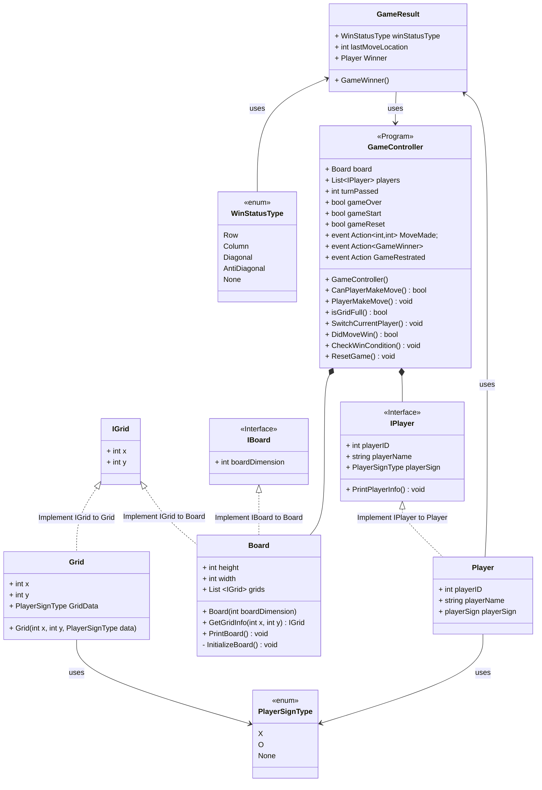

```mermaid
    classDiagram
        IGrid <|.. Grid : Implement IGrid to Grid
        IBoard <|.. Board : Implement IBoard to Board
        IGrid <|.. Board : Implement IGrid to Board

        IPlayer <|.. Player : Implement IPlayer to Player   
        Player --> PlayerSignType : uses
        Grid --> PlayerSignType : uses

        GameResult <-- WinStatusType : uses
        GameResult --> GameController : uses
        GameResult <-- Player : uses

        GameController *-- Board
        GameController *-- IPlayer


        class GameController{
            <<Program>>
            + Board board
            + List~IPlayer~ players
            + int turnPassed
            + bool gameOver
            + bool gameStart
            + bool gameReset

            %% Storing event as a variable when it does happen
            + event Action~int,int~ MoveMade;
            + event Action~GameWinner~ 
            + event Action GameRestrated

            + GameController()
            + CanPlayerMakeMove() bool
            + PlayerMakeMove() void
            + isGridFull() bool
            + SwitchCurrentPlayer() void
            + DidMoveWin() bool
            + CheckWinCondition() void
            + ResetGame() void
        }

        %% Each Cell
        class IGrid{
            + int x
            + int y
        }

        class Grid{
            + int x
            + int y
            + PlayerSignType GridData
            + Grid(int x, int y, PlayerSignType data)
        }

        %% Lets Start with the board
        class IBoard{
            <<Interface>>
            + int boardDimension
        }
        class Board{
            + int height
            + int width
            + List ~IGrid~ grids
            %% Constuctor of the Board
            + Board(int boardDimension)
            + GetGridInfo(int x, int y) IGrid
            + PrintBoard() void
            - InitializeBoard() void
        }
        
        %% Continue with the player
        class Player{
            + int playerID
            + string playerName
            + playerSign playerSign
        }

        class IPlayer{
            <<Interface>>
            + int playerID
            + string playerName
            + PlayerSignType playerSign
            + PrintPlayerInfo() void
        }

        %% About the Result Game Class
        class GameResult{
            + WinStatusType winStatusType
            + int lastMoveLocation
            + Player Winner
            + GameWinner()
        }

        class PlayerSignType{
            <<enum>>
            X
            O
            None
        }
        class WinStatusType{
            <<enum>>
            Row
            Column
            Diagonal
            AntiDiagonal
            None
        }
```