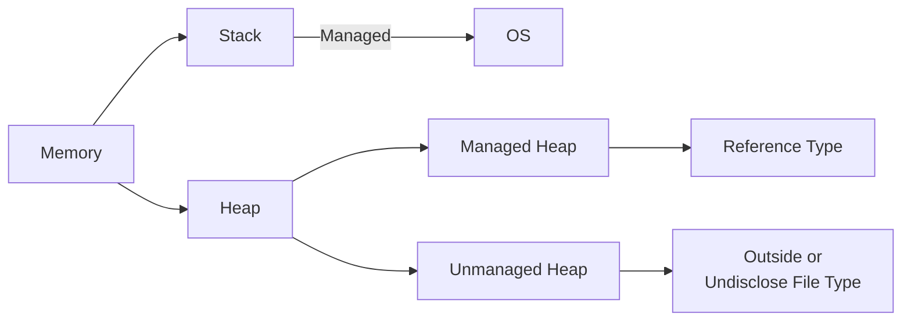
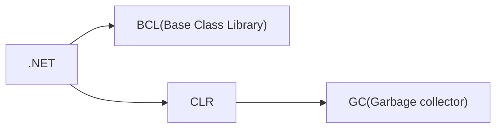

# Software Engineering Formulatrix Bootcamp
Here lies the base repo for the Formulatrix Software Engineering Bootcamp. C# Ecosystem will be used here

## Progress
### 1st day 
Build initial repo for the rest of the ongoing bootcamp, making an example of the branch, and installing the essential tools for the bootcamp (.NET(still dont know what is this), C# VSCode Extension, and SourceTree(Just like towergit)). 

For the first creation of the C# Project structure, the workflow of the creation is as follow
    `solution(sln) --> project(.csproj) --> assembly --> [.exe, .dll]`
Now for adding a new solution blueprint, how we do it? Below are the terminal command for it
```sh
dotnet new sln -n "filename"
```
After we make the solution, we can make the project based on those blueprint(solution) wih this command at the shell
```sh
dotnet new 'console' -lang "C#" -n "ProjectName" -o "CSPROJName"
```

* a-fact : in C#, everything needs to be done in class, just like Java I guess. I mean, maybe thats why Java is going to extinct
* a-fact : In default, variable in class C# is protected, no one from outside can access those the trick is to make a function to make them public and access them there
* a-fact again : in C#, every function or method in C# in this case, need everytime to evaluate each class with a type, so if you want a even need to return 

### 2nd Day
Another day continuing C# project inisialisation. Today we focus more using namespace and modulatization of each function in the project. Day 2 progress contained in Work2 Folder. The steps are like this, for more easy work, we can make a folder with itention the name of the namespace it is, because I want to make a namespace of `quadcopter` included a model also the motor parameter, I named my folder quadcopter.

    ├── Quadcopter
    ├──--- Model.cs
    ├──--- Motor.cs

With the in first of the line code at motor.cs is as folllows
```csharp
using System;
namespace Quadcopter;

// here lies how we construct the main class
public class Motor{
    // and here is the constructor
    public Motor(**args){
    }
}
```

But the problem is that I still don't get it how I achieve if I want to use another namespace as my calculation group with it parameter from another namespace and called it in my main program

Now, it's inheritance. 
Inheretence basically like super _init__ like python. So basically in python you go like this (I got this from ROS Gazebo class Node)
```python
from rclpy.node Import Node

class bigClass(Node){
    super().__init__('')
    # Something to code
}
```
in C#, we can do something similar like this
```csharp
public class Parents{
    // Constructor and Method here
}

public class Child:Parents{
    public Child():base(){
        // Code here
    }
}
```

### 3rd Day
In 3rd day, Types, Polyphremism, and Override Method was introduce here. The way I see it, we can use Override if there is derived childs from parent class that some of them have this behaviour and some of them are not. So, we can further save time from typing it. Override is special to method/function.

Ada juga pelajari tentang interface. Interface and Abstrack in C# is such a dumb idea. Probably wise to see some example of interface. Yeah interface is just for method. Bedanya pake modifier `abstrack` itu sama seperti `virtual`, saat method itu diganti pada class child itu kita bisa menggantinya dan bahkan di abstrak boleh ada isinya, sedangkan interface itu cuma boleh ada cetakan method doang

// Isi code contoh penggunaan abstract
```csharp
abstract class Shape{
    public abstract void Draw();
    public void ChangeColor(){
        Console.Writeline("Change color now!");
    }
    // and so on, we can put some abstract method here + some method blueprints that we want to derivate to the child. In this case the ChangeColor Method
}
```

// Isi penggunaan Interface
```csharp
interface IShape{
    void Draw();
    void MakeWay();
    // And so on, interface only provide blueprints method
}
```

// Pengunaan Abstract dan Interface
```csharp
public class Program{
    static void Main(){
        var circle = new Circle()
        circle.Draw();  // Draw a circle
        circle.Changecolor(); // Change Color now (if using abstract classifier)
    }
}

public Circle:Shape, IShape{
    // If its using Interface
    public void Draw(){
        Console.Writeline("Draw a circle in Interface!");
    }
    // If its using Abstract classifier access
    public override void Draw(){ // use override access 
        Console.Writeline("Draw a circle in Abstract Modifier");
    }
    // If using abstract classifier, the ChangeColor method will be inhereted here in Circle Class
}
```

`static` classifier adalah salah satu konvensi yang enak jika ingin membuat sebuah function tapi nggak mau repot memasukkannya kedalam sebuah `var` untuk dimasukkan

Previous assignment, for modularity there is components that we need to assign to a new variable to even access them, but with `static` classifier, we can use the function just by call their class. See example below:

// Without static
```csharp
public class Program{
    static void Main(){
        var engine = new Engine(); 
        engine.engineLast(); // See? We need var engine to even access the Engine Class
    }
}

public class Engine{
    public string engineType = "Diesel";
    public int engineLast(){
        return 1000;
    }
}
```

// With static
```csharp
public class Program{
    static void Main(){
        Engine.engineLast(); // See? so simple
    }
}

public static class Engine{
    public static string engineType = "Diesel";
    public static int engineLast(){
        return 1000;
    }
}
```

So if you want to directly access a field(variable) or a method(function), you need to add a static access modifier in front of them. Adding `static` in their parent class is preferable.


### 4th Day
Today, we learn more about stack and memory application usage of the C#. Generics is more about the replacement of the operator overloading.

Generics are the things concept that makes our life easier, the replacement of operator overloading if we still undecided which type of types we want but we still want to reuse those function. For example, let say we have swapper function, and we want to swap it like this

```csharp
using System;
					
public class Program
{
	public static void Swap(ref int x, ref int y){
		int s = x;
		x = y;
		y = s;
	}
	
	public static void Main()
	{
		int x = 3;
		int y = 4;
		
		Program.Swap(ref x,ref y);
			
		x.Dump(); // 4
		y.Dump(); // 3
	}
}
```

then what happens when all of the sudden, we also want to use the Swap() method to swap between strings? Well we have to again retype it the Swap() method all over again to meet those demands. But with generics, we can hold those decision until the function receive them, its like this

``` csharp
using System;
					
public class Program
{
	public static void Swap<T>(ref T x, ref T y){
		T s = x;
		x = y;
		y = s;
	}
	
	public static void Main()
	{
		string x = "Indonesia";
		string y = "Japan";
		
		Program.Swap<string>(ref x,ref y);
			
		x.Dump(); // Japan
		y.Dump(); // Indonesia
	}
}
```
`<T>` in `swap` function act as a mediator, as a 'generic' to replace what type of things we want to set, so we don't have to bother retyping it all over again. Where `<T>` value is connected when we first call the `swap` function as you can see after that there is `<string>` type there. So there you have it. You also can use them to make some of like <b>Field Method Generics</b> in the class.

Struct --> Just field/data variables. It is a value type only where struct cannot do inherince to other where Class --> Field & Method can do. Struct is another type of a class. So struct <b>IS NOT</b> a static, but more like a class. Nope never mind, Struct can contain a method, just look at this example provided by SE FMLX at Module Operator Overloading. Yeah I', just gonna ask it later tomorrow. For now, just push it agian to remote.

```csharp
public struct Point
{
    public int X { get; set; }
    public int Y { get; set; }

    public Point(int x, int y) // Isn't this constructor?
    {
        X = x;
        Y = y;
    }

    public static Point operator + (Point p1, Point p2) // and isn't this a method? fuck idk
    {
        return new Point(p1.X + p2.X, p1.Y + p2.Y);
    }
}
```

And there is Generics Constrain. Yeah idk what is this! maybe try again later? Yeah lets just skip this. Yes uhumm

// This is dumb, idk, extension method dumb
```csharp
using System;
					
public static class Program
{
	public static void Cetak(this object x){
		Console.WriteLine(x);
	}
	
	public static void Main()
	{
		int x = 8;
		Cetak(x); // output 8
		object y = 7;
		y.Cetak(); // This can do, output 7
	}
}
```

Ref, In , Out, SAFEEEE!!!!
```csharp
using System;
					
public static class Program
{
	public static void Main()
	{
		int refParameter = 27;
		int inParameter = 13;
		int outParameter;
		
		exampMethod(ref refParameter, in inParameter, out outParameter);
		
		Console.WriteLine(refParameter);
		Console.WriteLine(inParameter);
		Console.WriteLine(outParameter);
	}
	
	public static void exampMethod(ref int refParameter, in int inParameter, out int outParameter){
		refParameter += 10;
		
		//try{
		//	inParameter += 10;
		//}
		//catch(Exception e){
		//}
		outParameter = 5;
	}

}
```

Just treat ref as global, in as constant, and out is cool(idk lol)

### 4th Day Unrecorded
So, let's talk about enum, it is a little bit tricy, but in my perspective and my own reasoning, I define as enum is just an array of things(especially int) where we replace/try to making sure it replaced with a more common sense, a word. IT is useful when we talking about state treatment. We can setup enum like this


```csharp
public enum Months{ // Lets try to create an enumaration of month of kabisat year
    Jan,
    Feb,
    Mar,
    Apr,
    May,
    Jun,
    Jul,
    Aug,
    Sep,
    Oct,
    Nov,
    Des
}

class Program{
    static void Main(){
        Console.WriteLine(Months.Apr); // This will console 3
    }
}
```

So as you can seem, enum or enumeration is just a way to name our index, and (maybe lol) make our life easier, as I yet to find the usefullness of enum. Maybe something like state control?
```csharp
public enum State{
	PLAYING,
	PAUSED,
	GAME_OVER
}
```
maybe something like this will be proved useful. So enums is just really, an integer constant that <b>associated</b> with some kind of playwords, and we <b>do not</b> limit only with numbers, where it can be associated with more broad concept, maybe like example above we will associated those word months with <b>How many layoff happens in one month or how much salary does a person receive each month in a company</b> and etc. So, this kind of thing.


yeah I kinda skip the enum part, yeah lol.

Now for the params, so in fact, object method does need to return something, so it factually not a void at all.

### 5th Day
So for value type and reference type. When first inisiate their value by default is that value type tend to fill it with zero and reference type with null.

Ok so now we come to delegates. From the documentary, a delegate is a reference type that represents the method signature of a method. Yeah, me neither. I don't know the functionality here. Maybe just need to know about it. Yeah gooddamn what the fuck delegates mean. But here some example

```csharp
public delegate void MyDelegate(string word);

class Saturate{
    public static void Print(string word){
        Console.WriteLine($"Hai! {word}");
    }
    public static void Mush(string word){
        Console.WriteLine($"Kumbala Mush {word}!");
    }
}

class Program{
    static void Main(){
        MyDelegate roar = new MyDelegate(Saturate.Print);
        roar("Yoar");
        roar += Saturate.Mush;
        roar("Donot");
    }
}
```

So, how about we add another method to the assigned delegates?
```csharp
static void Main(){
    MyDelegate roar = new MyDelegate(Saturate.Print);
    roar.Invoke("Yoar");
    Console.WriteLine("Before adding mush method");
    roar += Saturate.Mush;
    Console.WriteLine("After adding mush method ");
    roar.Invoke("Donot"); // Invoke or run all method reside in the roar delegates
}
```

So, when delegates use a return type value, it will call the last method it will see with example below
```csharp
public delegate int MyDelegate(int x);

class Saturate{
    public static int Print(int x){
        // Console.WriteLine($"Hai! {word}");
        return (x + x);
    }
    public static int Mush(int x){
        // Console.WriteLine($"Kumbala Mush {word}!");
        return (x * x);
    }
}

class Program{
    static void Main(){
        MyDelegate roar = new MyDelegate(Saturate.Print);
        object result = roar(3);
        Console.WriteLine(result); // Will console 6

        Console.WriteLine("Before adding mush method");
        roar += Saturate.Mush;
        Console.WriteLine("After adding mush method");

        object result2 = roar(4);
        Console.WriteLine(result2); // Will console only 16, because mush was added last to roar();
    }
}
```

So, there is no meaning whatsoever using delegates when it have a return type. But maybe it will be useful when it was used as a broadcast function. Save time.

Yeah now it comes to Event Handler, but fuck fuck fuck what the fuck is this fuck. EventArgs is a documentation of the Event Handler. Keknya aku paham alurnya, cuma ya itu, ini isinya buat apa, rada aneh

So, I think we can use Event Handler as a Notification System, such as when People buy something, need kind some kind of feedback. But....

<b>Try Catch in C#</b> like any other programming languange it's pretty simple and straightforward manner. Try-Catch in C# should look like this

```csharp
try{
    // Code here
}catch(Exception e){
    // Throw error here
}
```
and an Example look like this
```csharp
public class Program
{
	public static void Main()
	{
		try{
            Run();
        }catch(Exception e){
            Console.WriteLine(e);
        }
	}
    static void Run(){
        Run();
    }
} // This will throw stack overflow error
```

And that's it! Now moving on to properties. Properties can also be a conditional.


### 7th Day
Today and in the next five day, we have been assigned to make a class diagram, where in my case is to make about the Checker Class Diagram.

- [x] Learn the history and how to play Checker
- [x] Construct the functional prosess of Checker Play
- [x] Make the overflow graph of the process
- [x] Make the class diagram with OOP in mind

Concept that want to be implemented
- Inheritence
- Interface
- Enums
- Delegates


### 7th Day Unrecorded
So, delegates, in nutshell delegates in C# is a feature to store a function in a variablee. Yeah you hear me, now we can store funtion inside a variable.  
But Boss, why we need them to store it in a variable? Isnt it enough we make them just static and access them through it?  
But how the concept of multiple subscribers?  

OK so, delegates are in concpet is how we have multiple function inside a variable and for more convinience can call/invoke them at the same time because they are really similarly so close to each other. Delegates have some varying, a delegate, an action, and a Func.

```csharp
// Delegate
public delegate void testDelegateFunction(); // Delegate can recive input and define it's output return type in the class properties

public action<int, float> testIntFloatFunc; // Action delegate can revice multiple inputs, butt it will return only return type. Probably best case used on when need to check something, but just need to log out those information but idk

public Func<int i, bool x> testIntBoolFunc; // Func delegate will only receive input, and it will return a type that has been set before in the generics format. In this case input must be int and the output return must be bool
```

### 15th Day
It said in the docs we had, that garbage collector is automatic so we don't have to worry a single thing about them now. But it said that garbage collector is 'usually expplicitly instigated'. What does this even mean? 

Maybe also need to explicitly explained what is this C#
1. Object
2. Field
3. Method
4. 

Garbage collector in C# is a thing that .NET developer infrasturctue menagmenet build to manage memory allocation automatically so we as the end-user of it do not have manually sort and decide which memory part are being used when declaring a variable of an object. Here some illustration to see this

<p align="center">
  
</p>

Yeah I know, you don't know it, but let me explain in by simplier and dummies term. When a collection occurs, any objects that are no longer in use (no references to them) have their memory freed up (deallocated). In C#, memory garbage is typically divide it into three gen memory allocation. Gen 0 is typically new and small objects. Where Gen 1 is between those of Gen 0 and Gen 2 which are still being used frequently, escaping the gen 0 marked. Finally we have Gen 2 who intially have been big size. So bigger memory tends to have bigger issued to clean up, like in real world bigger trash need bigger effort to clean it up. So, I'm just gonna copying it from their website is that, `an object should be short-lived or else live forever`. So, if a big-sized object makes it to gen 2, it needs to be there for a good reason, like `permanent object or reasuable object component`. If not, it's just using resource for free and we cannot put anything if it's continue like that. So in C# or maybe a lot of programming languange have standar memory allocation like this below


SO where is GC Located? Basically in .NET


GC triggers automatically if program memory cross the thresshold systme internally set. So before GC will run, all objects will have tagged of Gen 0. But GC can be resource intensive because when GC run, it will freeze the world and can negatively impact the performance of the program. 

[Here](https://www.codingame.com/playgrounds/6179/garbage-collection-and-c#:~:text=There%20are%20no%20specific%20timings,is%20running%20out%20of%20space.) are great example of referencing explanation about garbage collection.

So, lets provide an example of GC will run, here I have an example
```csharp
class Program{
    static void Main(){
        string result = String.Empty;
        int iteration = 100000;
        int angka = 50;
        for(int i=0; i<iteration;i++){
            result += "Hello";
            result += "Squidward!";
            if(i == 5000){ 
                result += angka.ToString();
            }
        }
        Console.WriteLine(result);
    }
}
```
by using JetBrains, we can see when GC run see picture below

<p align="center">
  
</p>

So, how GC trace this who is garbage or who is not? So in C#, they implements The garbage collector root objects, or simply roots are the starting point from which we begin our trace analysis. These objects are guaranteed to be alive, since usually are pointed by the global or local variables on the stack. Roots are typically define like something that will not die in process runtime like static and etc.

Man what does `0x7fed264011770` even mean?!? So in nutshell, GC will run if   
1. 


Out of topic but, here is the list of access broad  
Public  
Internal  
Protected  
Private  

<p align="center">
  
</p>


Yeah its random learn today. It is mainly Garbage Collector, Disposal, and Destructor(Finalizer). 