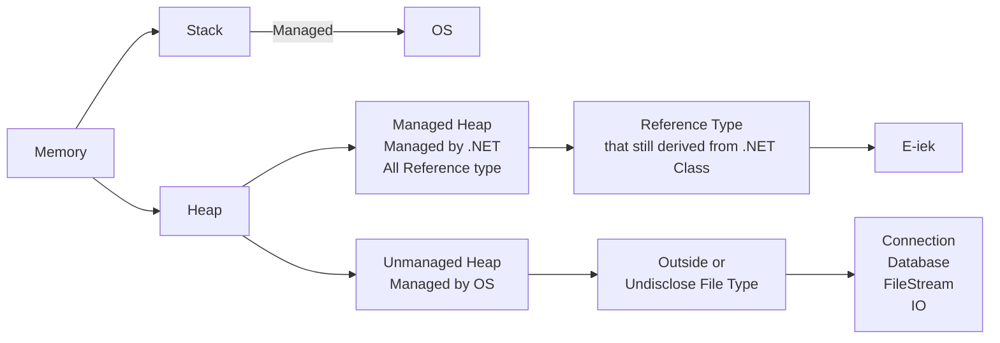
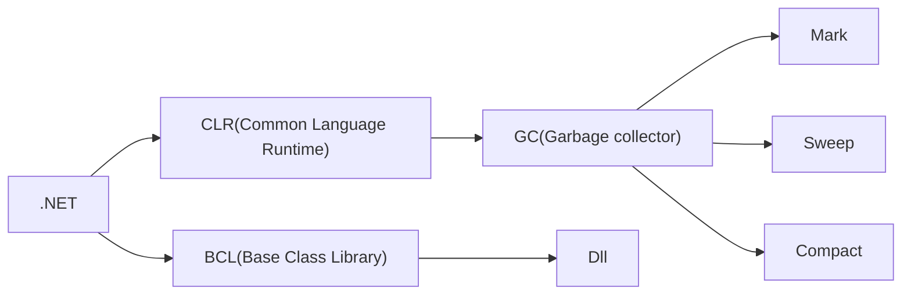
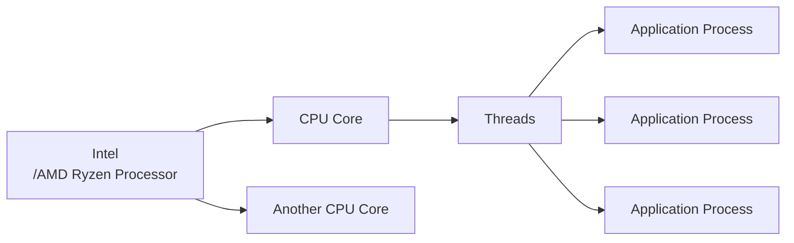
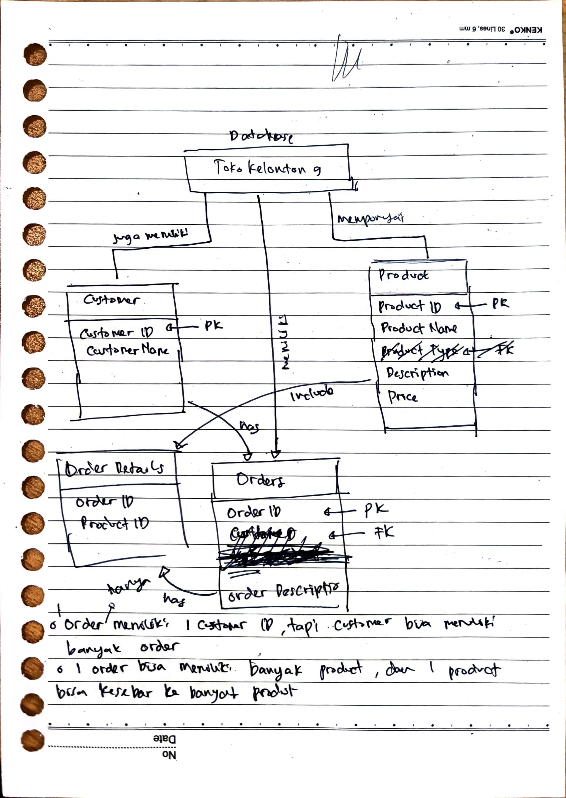
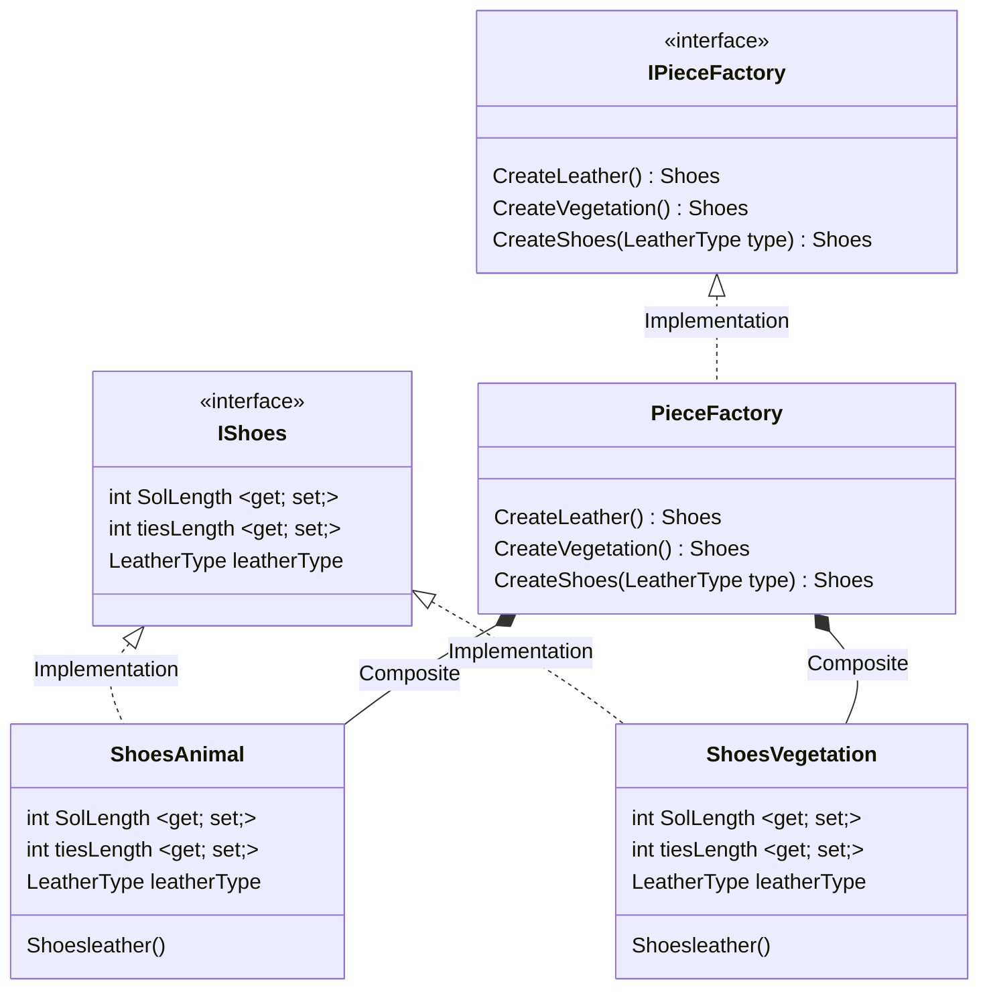
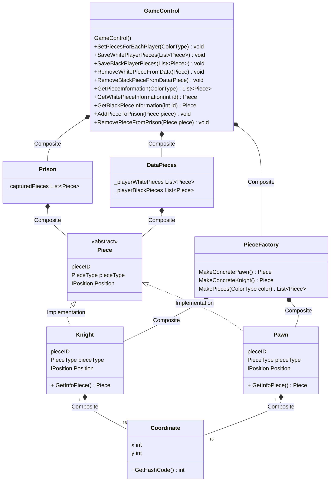
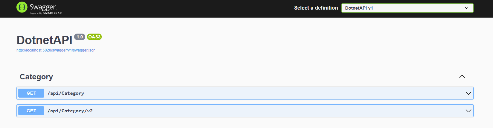

# Software Engineering Formulatrix Bootcamp
Here lies the base repo for the Formulatrix Software Engineering Bootcamp. C# Ecosystem will be used here

## Progress
### 1st day 
Build initial repo for the rest of the ongoing bootcamp, making an example of the branch, and installing the essential tools for the bootcamp (.NET(still dont know what is this), C# VSCode Extension, and SourceTree(Just like towergit)). 

For the first creation of the C# Project structure, the workflow of the creation is as follow
    `solution(sln) --> project(.csproj) --> assembly --> [.exe, .dll]`
Now for adding a new solution blueprint, how we do it? Below are the terminal command for it
```sh
dotnet new sln -n "filename"
```
After we make the solution, we can make the project based on those blueprint(solution) wih this command at the shell
```sh
dotnet new 'console' -lang "C#" -n "ProjectName" -o "CSPROJName"
```

* a-fact : in C#, everything needs to be done in class, just like Java I guess. I mean, maybe thats why Java is going to extinct
* a-fact : In default, variable in class C# is protected, no one from outside can access those the trick is to make a function to make them public and access them there
* a-fact again : in C#, every function or method in C# in this case, need everytime to evaluate each class with a type, so if you want a even need to return 

### 2nd Day
Another day continuing C# project inisialisation. Today we focus more using namespace and modulatization of each function in the project. Day 2 progress contained in Work2 Folder. The steps are like this, for more easy work, we can make a folder with itention the name of the namespace it is, because I want to make a namespace of `quadcopter` included a model also the motor parameter, I named my folder quadcopter.

    ├── Quadcopter
    ├──--- Model.cs
    ├──--- Motor.cs

With the in first of the line code at motor.cs is as folllows
```csharp
using System;
namespace Quadcopter;

// here lies how we construct the main class
public class Motor{
    // and here is the constructor
    public Motor(**args){
    }
}
```

But the problem is that I still don't get it how I achieve if I want to use another namespace as my calculation group with it parameter from another namespace and called it in my main program

Now, it's inheritance. 
Inheretence basically like super _init__ like python. So basically in python you go like this (I got this from ROS Gazebo class Node)
```python
from rclpy.node Import Node

class bigClass(Node){
    super().__init__('')
    # Something to code
}
```
in C#, we can do something similar like this
```csharp
public class Parents{
    // Constructor and Method here
}

public class Child:Parents{
    public Child():base(){
        // Code here
    }
}
```

### 3rd Day
In 3rd day, Types, Polyphremism, and Override Method was introduce here. The way I see it, we can use Override if there is derived childs from parent class that some of them have this behaviour and some of them are not. So, we can further save time from typing it. Override is special to method/function.

Ada juga pelajari tentang interface. Interface and Abstrack in C# is such a dumb idea. Probably wise to see some example of interface. Yeah interface is just for method. Bedanya pake modifier `abstrack` itu sama seperti `virtual`, saat method itu diganti pada class child itu kita bisa menggantinya dan bahkan di abstrak boleh ada isinya, sedangkan interface itu cuma boleh ada cetakan method doang

// Isi code contoh penggunaan abstract
```csharp
abstract class Shape{
    public abstract void Draw();
    public void ChangeColor(){
        Console.Writeline("Change color now!");
    }
    // and so on, we can put some abstract method here + some method blueprints that we want to derivate to the child. In this case the ChangeColor Method
}
```

// Isi penggunaan Interface
```csharp
interface IShape{
    void Draw();
    void MakeWay();
    // And so on, interface only provide blueprints method
}
```

// Pengunaan Abstract dan Interface
```csharp
public class Program{
    static void Main(){
        var circle = new Circle()
        circle.Draw();  // Draw a circle
        circle.Changecolor(); // Change Color now (if using abstract classifier)
    }
}

public Circle:Shape, IShape{
    // If its using Interface
    public void Draw(){
        Console.Writeline("Draw a circle in Interface!");
    }
    // If its using Abstract classifier access
    public override void Draw(){ // use override access 
        Console.Writeline("Draw a circle in Abstract Modifier");
    }
    // If using abstract classifier, the ChangeColor method will be inhereted here in Circle Class
}
```

`static` classifier adalah salah satu konvensi yang enak jika ingin membuat sebuah function tapi nggak mau repot memasukkannya kedalam sebuah `var` untuk dimasukkan

Previous assignment, for modularity there is components that we need to assign to a new variable to even access them, but with `static` classifier, we can use the function just by call their class. See example below:

// Without static
```csharp
public class Program{
    static void Main(){
        var engine = new Engine(); 
        engine.engineLast(); // See? We need var engine to even access the Engine Class
    }
}

public class Engine{
    public string engineType = "Diesel";
    public int engineLast(){
        return 1000;
    }
}
```

// With static
```csharp
public class Program{
    static void Main(){
        Engine.engineLast(); // See? so simple
    }
}

public static class Engine{
    public static string engineType = "Diesel";
    public static int engineLast(){
        return 1000;
    }
}
```

So if you want to directly access a field(variable) or a method(function), you need to add a static access modifier in front of them. Adding `static` in their parent class is preferable.


### 4th Day
Today, we learn more about stack and memory application usage of the C#. Generics is more about the replacement of the operator overloading.

Generics are the things concept that makes our life easier, the replacement of operator overloading if we still undecided which type of types we want but we still want to reuse those function. For example, let say we have swapper function, and we want to swap it like this

```csharp
using System;
					
public class Program
{
	public static void Swap(ref int x, ref int y){
		int s = x;
		x = y;
		y = s;
	}
	
	public static void Main()
	{
		int x = 3;
		int y = 4;
		
		Program.Swap(ref x,ref y);
			
		x.Dump(); // 4
		y.Dump(); // 3
	}
}
```

then what happens when all of the sudden, we also want to use the Swap() method to swap between strings? Well we have to again retype it the Swap() method all over again to meet those demands. But with generics, we can hold those decision until the function receive them, its like this

``` csharp
using System;
					
public class Program
{
	public static void Swap<T>(ref T x, ref T y){
		T s = x;
		x = y;
		y = s;
	}
	
	public static void Main()
	{
		string x = "Indonesia";
		string y = "Japan";
		
		Program.Swap<string>(ref x,ref y);
			
		x.Dump(); // Japan
		y.Dump(); // Indonesia
	}
}
```
`<T>` in `swap` function act as a mediator, as a 'generic' to replace what type of things we want to set, so we don't have to bother retyping it all over again. Where `<T>` value is connected when we first call the `swap` function as you can see after that there is `<string>` type there. So there you have it. You also can use them to make some of like <b>Field Method Generics</b> in the class.

Struct --> Just field/data variables. It is a value type only where struct cannot do inherince to other where Class --> Field & Method can do. Struct is another type of a class. So struct <b>IS NOT</b> a static, but more like a class. Nope never mind, Struct can contain a method, just look at this example provided by SE FMLX at Module Operator Overloading. Yeah I', just gonna ask it later tomorrow. For now, just push it agian to remote.

```csharp
public struct Point
{
    public int X { get; set; }
    public int Y { get; set; }

    public Point(int x, int y) // Isn't this constructor?
    {
        X = x;
        Y = y;
    }

    public static Point operator + (Point p1, Point p2) // and isn't this a method? fuck idk
    {
        return new Point(p1.X + p2.X, p1.Y + p2.Y);
    }
}
```

And there is Generics Constrain. Yeah idk what is this! maybe try again later? Yeah lets just skip this. Yes uhumm

// This is dumb, idk, extension method dumb
```csharp
using System;
					
public static class Program
{
	public static void Cetak(this object x){
		Console.WriteLine(x);
	}
	
	public static void Main()
	{
		int x = 8;
		Cetak(x); // output 8
		object y = 7;
		y.Cetak(); // This can do, output 7
	}
}
```

Ref, In , Out, SAFEEEE!!!!
```csharp
using System;
					
public static class Program
{
	public static void Main()
	{
		int refParameter = 27;
		int inParameter = 13;
		int outParameter;
		
		exampMethod(ref refParameter, in inParameter, out outParameter);
		
		Console.WriteLine(refParameter);
		Console.WriteLine(inParameter);
		Console.WriteLine(outParameter);
	}
	
	public static void exampMethod(ref int refParameter, in int inParameter, out int outParameter){
		refParameter += 10;
		
		//try{
		//	inParameter += 10;
		//}
		//catch(Exception e){
		//}
		outParameter = 5;
	}

}
```

Just treat ref as global, in as constant, and out is cool(idk lol)

### 4th Day Unrecorded
So, let's talk about enum, it is a little bit tricy, but in my perspective and my own reasoning, I define as enum is just an array of things(especially int) where we replace/try to making sure it replaced with a more common sense, a word. IT is useful when we talking about state treatment. We can setup enum like this


```csharp
public enum Months{ // Lets try to create an enumaration of month of kabisat year
    Jan,
    Feb,
    Mar,
    Apr,
    May,
    Jun,
    Jul,
    Aug,
    Sep,
    Oct,
    Nov,
    Des
}

class Program{
    static void Main(){
        Console.WriteLine(Months.Apr); // This will console 3
    }
}
```

So as you can seem, enum or enumeration is just a way to name our index, and (maybe lol) make our life easier, as I yet to find the usefullness of enum. Maybe something like state control?
```csharp
public enum State{
	PLAYING,
	PAUSED,
	GAME_OVER
}
```
maybe something like this will be proved useful. So enums is just really, an integer constant that <b>associated</b> with some kind of playwords, and we <b>do not</b> limit only with numbers, where it can be associated with more broad concept, maybe like example above we will associated those word months with <b>How many layoff happens in one month or how much salary does a person receive each month in a company</b> and etc. So, this kind of thing.


yeah I kinda skip the enum part, yeah lol.

Now for the params, so in fact, object method does need to return something, so it factually not a void at all.

### 5th Day
So for value type and reference type. When first inisiate their value by default is that value type tend to fill it with zero and reference type with null.

Ok so now we come to delegates. From the documentary, a delegate is a reference type that represents the method signature of a method. Yeah, me neither. I don't know the functionality here. Maybe just need to know about it. Yeah gooddamn what the fuck delegates mean. But here some example

```csharp
public delegate void MyDelegate(string word);

class Saturate{
    public static void Print(string word){
        Console.WriteLine($"Hai! {word}");
    }
    public static void Mush(string word){
        Console.WriteLine($"Kumbala Mush {word}!");
    }
}

class Program{
    static void Main(){
        MyDelegate roar = new MyDelegate(Saturate.Print);
        roar("Yoar");
        roar += Saturate.Mush;
        roar("Donot");
    }
}
```

So, how about we add another method to the assigned delegates?
```csharp
static void Main(){
    MyDelegate roar = new MyDelegate(Saturate.Print);
    roar.Invoke("Yoar");
    Console.WriteLine("Before adding mush method");
    roar += Saturate.Mush;
    Console.WriteLine("After adding mush method ");
    roar.Invoke("Donot"); // Invoke or run all method reside in the roar delegates
}
```

So, when delegates use a return type value, it will call the last method it will see with example below
```csharp
public delegate int MyDelegate(int x);

class Saturate{
    public static int Print(int x){
        // Console.WriteLine($"Hai! {word}");
        return (x + x);
    }
    public static int Mush(int x){
        // Console.WriteLine($"Kumbala Mush {word}!");
        return (x * x);
    }
}

class Program{
    static void Main(){
        MyDelegate roar = new MyDelegate(Saturate.Print);
        object result = roar(3);
        Console.WriteLine(result); // Will console 6

        Console.WriteLine("Before adding mush method");
        roar += Saturate.Mush;
        Console.WriteLine("After adding mush method");

        object result2 = roar(4);
        Console.WriteLine(result2); // Will console only 16, because mush was added last to roar();
    }
}
```

So, there is no meaning whatsoever using delegates when it have a return type. But maybe it will be useful when it was used as a broadcast function. Save time.

Yeah now it comes to Event Handler, but fuck fuck fuck what the fuck is this fuck. EventArgs is a documentation of the Event Handler. Keknya aku paham alurnya, cuma ya itu, ini isinya buat apa, rada aneh

So, I think we can use Event Handler as a Notification System, such as when People buy something, need kind some kind of feedback. But....

<b>Try Catch in C#</b> like any other programming languange it's pretty simple and straightforward manner. Try-Catch in C# should look like this

```csharp
try{
    // Code here
}catch(Exception e){
    // Throw error here
}
```
and an Example look like this
```csharp
public class Program
{
	public static void Main()
	{
		try{
            Run();
        }catch(Exception e){
            Console.WriteLine(e);
        }
	}
    static void Run(){
        Run();
    }
} // This will throw stack overflow error
```

And that's it! Now moving on to properties. Properties can also be a conditional.


### 7th Day
Today and in the next five day, we have been assigned to make a class diagram, where in my case is to make about the Checker Class Diagram.

- [x] Learn the history and how to play Checker
- [x] Construct the functional prosess of Checker Play
- [x] Make the overflow graph of the process
- [x] Make the class diagram with OOP in mind

Concept that want to be implemented
- Inheritence
- Interface
- Enums
- Delegates


### 7th Day Unrecorded
So, delegates, in nutshell delegates in C# is a feature to store a function in a variablee. Yeah you hear me, now we can store funtion inside a variable.  
But Boss, why we need them to store it in a variable? Isnt it enough we make them just static and access them through it?  
But how the concept of multiple subscribers?  

OK so, delegates are in concpet is how we have multiple function inside a variable and for more convinience can call/invoke them at the same time because they are really similarly so close to each other. Delegates have some varying, a delegate, an action, and a Func.

```csharp
// Delegate
public delegate void testDelegateFunction(); // Delegate can recive input and define it's output return type in the class properties

public action<int, float> testIntFloatFunc; // Action delegate can revice multiple inputs, butt it will return only return type. Probably best case used on when need to check something, but just need to log out those information but idk

public Func<int i, bool x> testIntBoolFunc; // Func delegate will only receive input, and it will return a type that has been set before in the generics format. In this case input must be int and the output return must be bool
```

### 15th/12th Day Actually
It said in the docs we had, that garbage collector is automatic so we don't have to worry a single thing about them now. But it said that garbage collector is 'usually expplicitly instigated'. What does this even mean? 

Maybe also need to explicitly explained what is this C#
1. Object
2. Field
3. Method
4. 

Garbage collector in C# is a thing that .NET developer infrasturctue menagmenet build to manage memory allocation automatically so we as the end-user of it do not have manually sort and decide which memory part are being used when declaring a variable of an object. Here some illustration to see this

<p align="center">
  
</p>

Yeah I know, you don't know it, but let me explain in by simplier and dummies term. When a collection occurs, any objects that are no longer in use (no references to them) have their memory freed up (deallocated). In C#, memory garbage is typically divide it into three gen memory allocation. Gen 0 is typically new and small objects. Where Gen 1 is between those of Gen 0 and Gen 2 which are still being used frequently, escaping the gen 0 marked. Finally we have Gen 2 who intially have been big size. So bigger memory tends to have bigger issued to clean up, like in real world bigger trash need bigger effort to clean it up. So, I'm just gonna copying it from their website is that, `an object should be short-lived or else live forever`. So, if a big-sized object makes it to gen 2, it needs to be there for a good reason, like `permanent object or reasuable object component`. If not, it's just using resource for free and we cannot put anything if it's continue like that. So in C# or maybe a lot of programming languange have standar memory allocation like this below


SO where is GC Located? Basically in .NET


GC triggers automatically if program memory cross the thresshold systme internally set. So before GC will run, all objects will have tagged of Gen 0. But GC can be resource intensive because when GC run, it will freeze the world and can negatively impact the performance of the program. 

[Here](https://www.codingame.com/playgrounds/6179/garbage-collection-and-c#:~:text=There%20are%20no%20specific%20timings,is%20running%20out%20of%20space.) are great example of referencing explanation about garbage collection.

So, lets provide an example of GC will run, here I have an example
```csharp
class Program{
    static void Main(){
        string result = String.Empty;
        int iteration = 100000;
        int angka = 50;
        for(int i=0; i<iteration;i++){
            result += "Hello";
            result += "Squidward!";
            if(i == 5000){ 
                result += angka.ToString();
            }
        }
        Console.WriteLine(result);
    }
}
```
by using JetBrains, we can see when GC run see picture below

<p align="center">
  
</p>

So, how GC trace this who is garbage or who is not? So in C#, they implements The garbage collector root objects, or simply roots are the starting point from which we begin our trace analysis. These objects are guaranteed to be alive, since usually are pointed by the global or local variables on the stack. Roots are typically define like something that will not die in process runtime like static and etc.

Man what does `0x7fed264011770` even mean?!? So in nutshell, GC will run if   
1. 


Out of topic but, here is the list of access broad  
Public  
Internal  
Protected  
Private  

<p align="center">
  
</p>


Yeah its random learn today. It is mainly Garbage Collector, Disposal, and Destructor(Finalizer). Yeah it is really confusing the need of these three if all of them is just automatically tended by .NET.

Why there are two Dispose by the way? The `Proteted virtual void Dispose` and `public void Dispose`?

Additionally more about Garbace Collector in Memory, particularly about Destructor. Destructor will 

### 13th Day
Apakah dispose itu kurang lebihnya membuat semua var menjadi null?

```csharp
externalResources = null;
```

yes, it's true. when we set something to null again. The object it referenced is no longer accessible and can now be garbage-collected. [Here](https://learn.microsoft.com/id-id/dotnet/csharp/language-reference/keywords/null)

`using` was used like disposing. Because when usinng keyword `using`, it will make our objec a reference type, so after it was being used, it will be oblirateed the second their program was run. But the fundamental question why we using syntacx `using` is still left unanswered. If you have time, please look into folder `Day 13\using`, I have tried to compared the usage of `using` and `try{}catch{}` of why we used `using` in the first place. I have tried building the comparison, but still need more correction

After that there's a debug. In C#, there is also a debugging process where we can run one-by-one of the line code to see anyproblem that makes our program unable to produce the result of what we want. Especially in using Visual Studio Code, we can use debug pretty easily. One way using it by go the Debug Tab or Ctrl+Shift+D to run it. 

Debug --> Mencari masalah yang ada pada program
Trace --> Menelusuri alur jalan program untuk mengetahui sebab anomali suatu program

So, IMO debug is a thing that we do if we want to know whic part of the code is not the same taste as us. Where trace provide us an easy way of logging data to trace or follow the lifecycle of the program.

### 14th Day
Today we learn about threading and about asynchronous process in the C#. Yes we can use threading for the individual project, which is real time drawing the board. 

But now let's move to the theories. All computers are dumb, yes. Because all they can know is that they only can run a program in a sequence manner. That a sycncrhonous process where a program will not run the next task if the current task is not yet completed. But is the other way around with asynchronous, with it we can immediately move on the the next process without waiting the current  process to be completed. A perfect analogy of Cooking breakfast is a good example of asynchronous work that isn't parallel. You start with warming the pans, after the pans are warm enough you can start putting the eggs. Even though the eggs are not throughly cooked, we can move onto next process of cooking the bacons. At the same time, maybe you want to put the bread on the toaster so when the eggs and bacon are ready, you can serve them at the same time. At each step of the process, you'd start a task, then turn your attention to tasks that are ready for your attention. That is asynchronous process.

<p align="center">
  
  
</p>

Here lies the segmentation of C# Asynchronous process


Thread and Task. Thread collection of the sequence will also be affluence by the `Thread.Start()` method. So if we push the thread.Start() ahead of the synchronous program, it will 50/50 be run first, but if we put it at the end of the program latter to synchronous programming, it will definetly will run after the synchronous program. Below output example for the code at `Day 14\AsyncProcess\Program.cs`

If its not using Threads
```
Pouring cofee to cup!
Coffee has been served!
2 noodles goes to wok!
Noodles has been coocked!
Ongoing work fry 3!
Egg has been fried
Total program duration : 6ms
```

If its using thread
```
Coffee has been served!
Noodles has been coocked!
Egg has been fried
Pouring cofee to cup!
Total program duration : 6ms
Ongoing work fry 4!
2 noodles goes to wok!
```

If the thread was place at the end of program
```
Coffee has been served!
Noodles has been coocked!
Egg has been fried
Total program duration : 4ms
Pouring cofee to cup!
2 noodles goes to wok!
Ongoing work fry 4!
```

So, as you can see, using `Threads` is unmanagable because you can't set the task asynchronoiusly the way you want it to be. So, we can use `Task` and `Async`&`Wait`. But here's the problem, I still don't know the baseline usecase for this Threads. Hmm I still confuse what should I write for this usecase?

 they said we should prevent `Thread.Sleep` from happening, but I think Thread.Sleep usecase is to debug what happen in the process slowly

 It has been answered, because `Thread` cannot have or store a return value when the method was called over the Thread. So we can use Task? But what is Task? Task is better than Thread when used on asynchronous programming.

 Now move onto lock, Threads are great, but sometimes it will happen when multiple threads accessing the same thing(method nor field variables). So, lock is a great thing to limit the access of multiple threads, preventing threads using them methods at the same time. Usecase as follow

 ```csharp
 using System;
using System.Threading;

    class Program{
       static readonly object pblock = new object(); // The key
       static readonly int gear = 2;
       public static int result = 0;
       static void PrintInfo(int adder){
        if(gear==1){
            lock (pblock){
                for (int i = 1; i <= 4; i++)
                {
                    result += adder;
                    Console.WriteLine($"i value: {i}, Name: {Thread.CurrentThread.Name},  tid {Thread.CurrentThread.ManagedThreadId}, result {result}");
                    Thread.Sleep(1000);
                }
            }
        }else{
            for (int i = 1; i <= 4; i++)
            {
                result += adder;
                Console.WriteLine($"i value: {i}, Name: {Thread.CurrentThread.Name},  tid {Thread.CurrentThread.ManagedThreadId}, result {result}");
                Thread.Sleep(1000);
            }
        }
       }
       static void Main(string[] args)
       {
          Thread t1 = new Thread(() => PrintInfo(1));
          Thread t2 = new Thread(() => PrintInfo(2));
          Thread t3 = new Thread(() => PrintInfo(3));
          Thread t4 = new Thread(() => PrintInfo(4));
          Thread t5 = new Thread(() => PrintInfo(5));
          t1.Name = "T1";
          t2.Name = "T2";
          t3.Name = "T3";
          t4.Name = "T4";
          t5.Name = "T5";
          t1.Start();
          t2.Start();
          t3.Start();
          t4.Start();
          t5.Start();
          // Console.ReadLine();
       }
    }
 ```

 if we choose the gear option of 1, where it have locks, the result have consistent ending where it should have the sum of the result is 60
```
i value: 4, Name: T5,  tid 8, result 60
```

 But if we choose the gear option 2, where it doesnt have locks, the result will not have consistentsy ending because the result variable will be access and at the same time will be edited by the threads.
 ```
 i value: 4, Name: T3,  tid 6, result 56
 ```

 So, as you can see, lock prevent inconsistesy and prevent access confusion within the program


 ### 16th Day
 15th was skipped because I was not there during the class. But from what I hear, the 15th days discussed about the threat of multithreat(get it?). So in order to make it more safely, we can use lock and semaphore. and any other alternatives such as signaling(autoresetevent) and monitoring enter

 Semaphore it's intensive resource, so the alternative of it we can use Semaphore Slim. So look at this code example below
 ```csharp
 class Program{
    static SemaphoreSlim semaphoreSlim = new(3);
    static SemaphoreSlim semaphoreSlim2 = new(2);
    static async Task Main(){
        // Making 10 new task
        Task[] tasks = new Task[10];
        for(int i=0;i<tasks.Length;i++){
            int index = i;
            tasks[index] = Task.Run(async ()=> await DoWork(index));
        }
        await Task.WhenAll(tasks);
    }
    static async Task DoWork(int index){
        Console.WriteLine($"Task {index} started");
        
        await semaphoreSlim.WaitAsync();
        // Code below will be only run on spesifcic task
        //await Task.Delay(500);
        Console.WriteLine($"Task {index} processing");
        //await semaphoreSlim2.WaitAsync();
        //await Task.Delay(500);

        semaphoreSlim.Release();
        Console.WriteLine($"Task {index} ended");
    }
}
 ```

ini cara baca alur programnya gimana dah wkwk kalo hasil outpunya jadi begini
```
Task 3 started
Task 1 started
Task 6 started
Task 0 started
Task 4 started
Task 7 started
Task 2 started
Task 5 started
Task 9 started
Task 8 started
Task 3 processing
Task 1 processing
Task 1 ended
Task 3 ended
Task 6 processing
Task 0 processing
Task 0 ended
Task 6 ended
Task 7 processing
Task 4 processing
Task 4 ended
Task 7 ended
Task 5 processing
Task 2 processing
Task 2 ended
Task 5 ended
Task 9 processing
Task 8 processing
Task 8 ended
Task 9 ended
```

Yeah im still dont get it wkakakak.
Yeah lets just move on, lets applicate in on the final project for easier understanding. Now in 16th day we will be discussing about Stream and System.IO.

Stream or maybe should I say buffer? Stream is an act of sending file through a 'aliran' or should i say like a flow of data from say process A to process B, through a stream of data.  

1. Stream Adapters  
2. Decorator Streams (Optional)  
3. Backing Store Stream  

So, just know it before, we will be dealing a lot with the third part of Backing Store Stream. Like maybe when we want to send say possibly an image, image is often related to their big size, and when sending them, it's not possible to send it just like their format .jpeg or .png. Byte is a universal packet size that any other computer recognize, so handling big data types with buffer or stream is the easiet way to do it.

For buffer reference, you can see it here https://learn.microsoft.com/en-us/dotnet/api/system.io.bufferedstream?view=net-8.0. 

With buffers and stream, we can do alot about file manipulation about it. One of the example is to convert class fields into a json file provided below

```csharp
using System;
using System.Text.Json;

public class Human{
    public string name {get ; set;}
    public int age {get;set;}
    public Human(string name, int age){
        this.name = name;
        this.age = age;
    }
}

class Program{
    static void Main(){
        Human yusa = new("Yusa",26);
        Human ega = new("Ega",22);
        Human rizky = new("Rizky", 24);
        Human fadil = new("Fadil", 24);
        Human dewi = new("Dewi", 25);
        Human wulan = new("Wulan", 29);
        Human bella = new("Bella", 24);
        Human kinara = new("Kinara", 27);
        Human jun = new("Juni", 23);

        List<Human> boocampMember = new List<Human>(){
            yusa,ega,rizky,fadil,dewi,wulan,bella,kinara,jun
            
        };

        string JASON = JsonSerializer.Serialize(boocampMember);
        using(StreamWriter streamWriter = new("file1.json")){
            streamWriter.Write(JASON);
        }
        }
}
```

And we can go even further!Maybe we can input the data manually and Maybe make a double thread where one thread is to manage the input from the user and simulstaiantly when new data(user input) arrive, we can instatnly just save them in the json file. It's an idea. Myabe with thread or Task? Idk.

And lets talk about Data Contract. Sometimes, when we want to export a value of field there will be non-accesible because some of the field is private. And because of that, we cannot export them into another type of data.

```csharp
public class Human{
    private string name;
    public int age {get;set;}
    public Human(){}
    public Human(string name, int age){
        this.name = name;
        this.age = age;
    }
}
```

as you can see, the name cannot be displayed when we extract them especially to .xml or .json or any external data types, because of this nature of private method doesn't allowed those field data cross outside it's own class. So, we can use [DataContract] for this.

```csharp
[DataContract]
class Player{
    [DataMember]
    private string _name;
    [DataMember]
    private int _money;
    [DataMember]
    public int Gold{get;set;}
    [DataMember]
    public int exp{get;set;}

    // public int Gold {get;private set;} bedanya ini
    // private int _Gold {get; set;} sama ini apa ya?
    public Player(string name, int money, int gold, int exp){
        this._name = name;
        this._money = money;
        this.Gold = gold;
        this.exp = exp;
    }
}
```

So serializer and deserializer is a way of something to write and read from external data away for C# Ecosystem. SO yeah, lets goo Individual Projekt

### 20th Day
Today will be an understanding of topics, which is a common principle in building blocks of programming, one of it is <b>SOLID</b>> Principle.

```
├── S(ingle) Responsibility Prinsiple
├── O(pen)-Closed Principle 
├── L(iskov) Subtitution Principle
├── I(nterface) Segregation Principle
├── D(ependency) Inversion Principle
```
I Need to remember that in C# it's all about class, everything are wrapped inside a class, so there will be multiple class that neet to be adhered into this SOLID principle.

Single Responsibility Principle means that one class should only one-responsibility only and not owning multiple responsibilities as well. Responsibilities should be shared and not owning by itself. Then, by example, PlayerData inside contain multiple data, which is List of Pieces, List of Players, and Dictionary of List of Player <--> List of Pieces. So maybe the structure now can be like this?

```csharp
public PlayerDataCollection{
    List<Piece> pieces;
    List<IPlayer> player;
    Dicionary<Player, List<Piece>> playerData;

}
public piecesHandler{
    // Handle the piece
}

public playerDataHandler{
    // Handles the player
}

public playerDataHandler{
    // Handles the dictionary
}
```


### 21th Day
Today, we learn more about Unit Testing. Unit testing as like will this thing break if I put it somehow outside it's expectation? It is to see that more possible bugs about the program, and to see that does the program does meet our output expectation?

In unit testing C#, there are multiple testing condition, which is `[Test]`, `[TestCase]`, `[Fact]`, `[Theory]`

So, unit testing is like that, if we want to test multiple unit part at once, we can make the code structure to look like this exampple
```
├── Calculator (Main Program)
├── Calculator.Test (Test 'X' part of Main Calculator Program) 
├── Calculator.Test.Another (Test 'Y' part of Main Calculator Program) 
├── etc
```

so if you `dotnet test` in the root of the workspace, it will run all the available test case in the workspace.

After that, lets talk about debug. Debug is a way to find the meaning of the workflow of the program. So, there are many tools to have debug our way to the program. One of it is using Microsoft Logging. In C#, or .NET, we can use those package by installing the packages first using the dotnet console program, like this

```bash
dotnet add package Microsoft.Extensions.Logging
dotnet add package Microsoft.Extensions.Logging.Console
```

Why using Microsoft Logging Extensions? Several logging levels are available in the Microsoft.Extensions.Logging framework in C#, enabling developers to classify and rank log messages according to their significance and severity. Such as Trace, Debug, Information, Warning, Error, and Critical.

Many other ways to download a package, an external package(library), we can use many ways
1. Search 'Nuget Package Manager' in the Visual Studio Code Extension Marketplace
2. Directly download from the website 'https://www.nuget.org/downloads'
3. Using NLog?!


NLog like this steps
1. Install the NLog Package first from the Nuget Package Manager [here](https://www.nuget.org/packages/NLog/)
2. Type the installation command line at the workspace
    ```bash
    dotnet add package NLog 
    ```
3. Make the NLog.Config and put it in the parent dir
    ```xml
    <?xml version="1.0" encoding="utf-8" ?>
    <nlog xmlns="http://www.nlog-project.org/schemas/NLog.xsd"
        xmlns:xsi="http://www.w3.org/2001/XMLSchema-instance">

        <targets>
            <target name="logfile" xsi:type="File" fileName="file.txt" />
            <target name="logconsole" xsi:type="Console" />
        </targets>

        <rules>
            <logger name="*" minlevel="Info" writeTo="logconsole" />
            <logger name="*" minlevel="Debug" writeTo="logfile" />
        </rules>
    </nlog>
    ```
4. Here an example of NLog Start Configuration
    ```csharp
    using NLog;
    using NLog.Config;

    class Program{
        public static Logger logger = LogManager.GetCurrentClassLogger();
        static void Main(){
            // Access NLOG Class
            LogManager.Configuration = new XmlLoggingConfiguration("NLog.config");

            logger.Debug("Starting Main");
            logger.Info("Starting Info");
            logger.Info("Program Finished");
        }
    }
    ```

### 22th Day
Today we gonna learn about Entity Framework. So what is this creature? So according Bill Gates Microsoft
```
Entity Framework (EF) is an object-relational mapper that enables .NET developers to work with relational data using domain-specific objects. It eliminates the need for most of the data-access code that developers usually need to write.
```

So, from the definition above, EF is C# thing where we define a class as the exact clone framework of the database mapped to the class object in the C# program. With Entity framework, we save the data into the quaryable object in the C# program. So we do not need to know about the query languange of the database. Instead we can use the Entity framework to Create,Read,Update, and Delete data from/to database. So, in order to use an Entity Framework, we need to do something first.

First we need to install the necessary pacakge to connect from our C# program to the database. Thankfully, C# Microsoft already provides tons of package/API to connect to various database such as SQLite, SQL Server, PostgreSQL, NoSQL, and etc. To have this pacakge we must install them first into our projects. So go to your path folder projects and type this. In this case, I'm in `.\Day 22\EntityFramework`

```bash
dotnet add package Microsoft.EntityFrameworkCore
dotnet add package Microsoft.EntityFrameworkCore.Sqlite
```

so `Microsoft.EntityFrameworkCore` is the base library for database connection, where because we want to use this [database](https://code.google.com/archive/p/northwindextended/downloads) where the format is sqlite3. We can further donwload the spesific package which is `Microsoft.EntityFrameworkCore.Sqlite`.

Ok so because we know that we want to use database format sqlite3, we need to install some tools to support the visualization and the need of information of it. There are some tools for viewing and building the shematics of this db, which is first we can install sqlite3 terminal cli to our workstation. You can see the sqlite3 tutorial installation [here](https://www.youtube.com/watch?v=L3FwRRx6bqo) for the installation. 

Because the [database](https://storage.googleapis.com/google-code-archive-downloads/v2/code.google.com/northwindextended/Northwind.Sqlite3.sql) are still in their sql script file as you can see the name is `Northwind.Sqlite3.sql` not `Northwind.db` we need to <u>build</u> the database first to actually use them in their actual format. So still in our workstation because I put the database there, we can type in the terminal

```bash
sqlite3 "Database Name.format" --init "Location of the Database script format"
```
So,
```bash
sqlite3 Northwind.db --init Northwind.Sqlite3.sql
```

We can also install additional tools in the project workstation like this
```bash
dotnet tool install dotnet-ef --global
```


So we all now set, and we can now connect our databse using the original Microsoft database API, which is this `Entity Framework`.

So the task is, where we place the program to connect to the database, where to <u>model</u> our tables in program to match the database. And to combine all of those to connect the databse and having fun with the data. Here the simple structure of the EF.

```
├── Model (The name of the each column of the table to match the database)
├── Database (The program to set initial properties to prepare connection to database itself) 
├── Program.cs (Instantiate databse program so we can use connect() method)
```

So lets say we have initialize the database and want to read the tables of Categories. So EF basically how we want to mapped between tables of the database into our newly build object. So lets say I want to access the table of `Categories` in the table of Northwind Database, we shall make the matchmaking of table name `Category.cs`. There are unique point in this one. So in the table of Category in Northwind.db. 

| CategoryID | CategoryName | Description |
| ---------- | ------------ | ----------- |
| 1          | Beverages    | Soft Drinks |
| 2          | Condiments   | Sweet       |
| 3          | Convections  | Deserts     |
| etc        | etc          | etc         |

And there is unique point in this case, based on [this](https://erikej.github.io/efcore/2020/04/26/ef-core-pluralization.html), and [this](https://github.com/Humanizr/Humanizer). It said
```
EF Core 3 supports pluralization by convention, and allows you to enable and customize it. When pluralization is enabled, you will by convention get pluralized DbSet and navigation property name.
```
So, EF will <u>automatically convert</u> pluralization to single names. So those table above are name `Categories`. So when we register our mapped object to our desired tables in this line

```csharp
public DbSet<Category> Categories {get;set;}
```
This DbSet functionality from the EF Core will <u>automatically</u> tried to search the form pluralization of `Category` which is `Categories` that <u>is found</u> in the names of the table found in the sqlite3. So, it will automatically know who is the Primary Key in the tables without us explicitly type it in the program. Just like this.


```csharp
using System;

public class Category{
    public int CategoryID {get; set;} // The name in the model [MUST] match the name of column in the table database
    public string? CategoryName {get; set;}
    public string? Description { get; set; }
}
```

But, if in some cases, the table names is an irregular word, the EF Core is not going to work right? Or we want a totally different name model in our object compared to the name of the table. We can use the Data Attribute provided by the C# System Functionality. We also need to explicitly tell the DbSet who is the primary key to also match the database. Just like this
```csharp
using System;
using System.ComponentModel.DataAnnotations;
using System.ComponentModel.DataAnnotations.Schema;

[Table("Categories")]
public class Categories{
    [Key]
    public int CategoryID {get; set;} // The name in the model [MUST] match the name of column in the table database
    public string? CategoryName {get; set;}
    public string? Description { get; set; }
}
```

Just like above, because we want to map it to the table name `Categories`, we define the table namespace using the data annotations. And to define the key of this table, we can use the `[Key]` data annotation just before the field in the question. So in my code, I will adhered the rules and make it just following the recomendation, which is using the Humanizer.


Ok So I want to provide of how to CRUD using EF. With the example of it I will try it on the Northwind Database on the categories table. 

<b>Read data</b>
Ok it's pretty easy actually to read some data of some tables.Because we already build the model of the tabel itself, we can run this type of command to read the spesific table, which is in this case is like this

```csharp
    using (NorthWind db = new()){
        // So first we just access the Categories simply
        // by db.Categories, this will work because we have set it
        // on the DbContext at the Northwind.cs file
        List<Category> categories = db.Categories.ToList();

        // Just enumerate them and you done, you can acesss each row of the data by simply category.
        foreach (var category in categories){
            Console.WriteLine(category.CategoryName);
        }
    }
```


<b>Create/Add data</b>  
So, to actually need to add new data/row data to the existing column or table, we can do that actually realy the same way as we read the data itself. So the step is actually we tried to acess the data off from the tables, store it on the object in our program, then after that we can staged them in the object db connection then push it to the database to handle. So the code is like this

```csharp
    using(NorthWind db = new()){
        // Create new instances of the model
        Category categories = new();
        // Hold the data to temp object in the program
        categories.CategoryName = "Coffee";
        categories.Description = "Nescafe, Arabica, and Jamaica";

        // Move the data from the object to db object
        db.Categories.Add(categories);

        // Save or push the data to the database
        db.SaveChanges();
        Console.WriteLine("{0} with description of {1} has been added to database!", categories.CategoryName, categories.Description);
    }
```

<b>Update data</b>   
Ok now to actually update a spesific row data inside the tables, the way we do it is really similar of how we want to add a new row data into the tables. The difference is when we store the spesific row data that we want to update, we just can immediately push the data back to the sqlite3 databse after we change the content of the data. This is because the database will handle the rest. So, to update a data, a simple code to do it is like this 

```csharp
    using(NorthWind db = new()){

    // Try to search particular row that have the name of Produce
    Category categories = db.Categories.Where(data => data.CategoryName == "Warmindo").First<Category>();
    // You can also filter the data using their unique individual ID like this
    // Category categories = db.Categories.Find(9);

    // Change the data of the particular filter data spesific
    categories.Description = "This Warminod is getting edited";

    // Update the data, no need to like db.Categories.Add / any syntax that has the same meaning like db.Categories.Update
    // Just push it immediately
    db.SaveChanges();
}
```

<b>Delete data</b>  
While we have smooth run on the CRU(Create, Read, Update), it is not so easy when Deleting Data from the Database especially when it come to SQL. SQL have this concept Primary Key and Foreign key where spesifically with Foreign Key, we can use another tables as a value refeence to other some tables. So, if the tables we want to talk about for this example the `Categories`, where the CategoryID was used as FOREIGN KEy in another tables, we need also to delete other row data that used the CategoryID as their value. So it is a little bit tricky and I will update this docs ooce I found how to do it, because now I'm stuck

So, lets contine with Database First, then Code First. or should I say DataFirstCodeFirst. Why concept of building the databse first is crucial rather than programming the program first. This opinion holds by some talks in the book title 'Getting Real'
```
Too many apps start with a program-first mentality. That's a bad idea. Programming is the heaviest component of building an app, meaning it's the most expensive and hardest to change. Instead, start by designing first.
Design is relatively light. A paper sketch is cheap and easy to change. html designs are still relatively simple to modify (or throw out). That's not true of programming. Designing first keeps you flexible. Programming first fences you in and sets you up for additional costs.
```

So, if the database has been build, the program can simply fit to the structure. So, for building database from ground zero in C#, there are three main package that we need to make it happens, which is
```csharp
using Microsoft.EntityFrameworkCore;
using Microsoft.EntityFrameworkCore.Sqlite;
using Microsoft.EntityFrameworkCore.Design;
```

So now go sucker and download three of them first. Ok, so after finish downloading them, put all those package in the code that was used to connect our program to the future database we want to build. Especially `using Microsoft.EntityFrameworkCore.Design` because when we try to build our database and not include that, it will throw an error, so don't forget!. So, the mentality of Database-First is to build the database first then the program. In this case, I will try to make a store Indonesia System, which is `Toko Kelontong` inventory system. To make it really simple for this example, I'm just gonna add the system about it customer data, the product data, and the customer order list data. So, for easier visualization, I have made simple visualization about the table I want to build.

<p align="center">
  
</p>

| The Relation                                                                     |
| -------------------------------------------------------------------------------- |
| One Order will only have one Customer, but One Customer will have many order     |
| One Order will have many product there also One Product could be in many product |

As you can see, Orders<-->Products have `*--*` or many-to-many relationship. Because typically SQL or table database do not support many-to-many relationship, there is a need of another table to relate those two altogether, and thats how OrderDetails comes in.

Anyways, we can start with building it's model. So first, Customer. As you can see, Customer table will have data about their ID and their name. Where it have relation with Order where it used it CustomerID as a <u>reference</u> or FOREIGN KEY. So, in the model, we can build it like this and use Data Table Annotation to make it explicitly known.

```csharp
[Table("Customers")] // Table Annotation
public class Customer{
    [Key]
    public int CustomerID { get; set; }
    public string CustomerName { get; set; } = null!;

    // Declare the relation between each model/table in the database
    public IEnumerable<Order> Orders {get;set;} = null!;
}
```
As you can see, the syntax with `[]` point to Data Table Annotation, I know [that](https://erikej.github.io/efcore/2020/04/26/ef-core-pluralization.html) there EF is automatically will try to look for the pluralization of our Model Class, but explictly tell it like that will make good behaviour to <u>tell others that this is the PRIMARY KEY and this is THE TABLE NAME CUSTOMER</u>. All the other tables are set the same as the above that to separate them from it's own original data and its relationship with other model/tables. For the Order Details, the examples are shown below

```csharp
[Table("OrderDetails")]
public class OrderDetail{
    [Key, ForeignKey("Orders")]
    public int OrderID { get; set; } // Will become the primary key and at the same time
    [Key, ForeignKey("Products")]

                                      // Foreign Key
    public int ProductID { get; set; }// Will become the primary key and at the same time
                                      // Foreign Key
    public int ProductQuantity {get;set;} // Each individual product quantity

    // Declare the relation between each model/table in the database
    public Order Orders {get;set;} = null!;
    public Product Products {get;set;} = null!;
}
```

So because OrderID and ProductID act as PRIMARY KEY and FOREIGN KEY at the same time, the data table annotation are shown like above. Ok, now moving on to the database model building and creation. For this, FluentAPI was used for this case, so move on to the `Kelontong.cs` where this file was used to connect, create, and build the database. As you can see for the Customer model

```csharp
// Model creation of Customer
modelBuilder.Entity<Customer>(customer =>{
    customer.HasKey(column => column.CustomerID); // Primary Key
    customer.Property(column => column.CustomerName).HasColumnType("TEXT"); // Property configuration
    customer.HasMany(column => column.Orders) // One-to-many relationship
            .WithOne(order => order.Customer) // One Order can only have one Customer (Customer ID)
            .HasForeignKey(order => order.CustomerID);
});
```

Where in here, we can also set the model properties by `HasKey` for setting the PrimaryKey, `Property` for it fields properties edit, and {`HasMany`,`WithOne`} to set the relation between models. As for setting `HasForeignKey` will only work after we set the relation with each program. so if there is no setting for the HasMany or WithOne, we cannot set the FOREIGN KEY to anohter class. I will also included the model building for the OrderDetails model.


```csharp
// Model creation of Order Detail
modelBuilder.Entity<OrderDetail>(orderdetail =>{
    orderdetail.HasKey(orderdetail=> new { orderdetail.OrderID, orderdetail.ProductID });
});
```

So, as you can see, the build of OrderDetails only has little configuration, and there is no setting up for the relation. Does't orderDetails relate to two tables/models? Which is the Order and the Products? Well because in FluentAPI, when defining the relationship of between tables, we can put the relation information on one of the tables! So,

```csharp
// Model creation of Product
modelBuilder.Entity<Product>(product =>{
    product.HasKey(column => column.ProductID);
    product.Property(column => column.ProductName).HasColumnType("TEXT");
    product.Property(column => column.Description).HasColumnType("TEXT");
    product.HasMany(column => column.OrderDetail)
            .WithOne(orderdetail => orderdetail.Products)
            .HasForeignKey(orderdetail => orderdetail.ProductID);
});
```

as you can see, because table Product has defined the relation between OrderDetail here, it is optional to put it in the ModelBuilder of orderDetails. So, I think that's it for the database model building. After we finish the rest, to When building the database, the command line for that is this

```bash
dotnet-ef migrations add "commit-message"
dotnet-ef database update
```

After running the command line in the terminal, the database successfully build if the notification is sucessfull and .db is shown in the file explorer. As for the CRUD Method is to far long to be shown in this doc, all the CRUD method have been uploaded [here](./Day%2022/TaskStoreDatabase/dbConnection.cs), with well completly harmless comments so you can understand it. So after some tweeking, here are some of the reading of the database of List of Orders that was made by each custsomer.

```text
Database is connected
List of Order made by Customer
=================
List of Order made by Customer
1 : John Fon Due
    OrderID8   ID4   Brown Rice                Quantity:12  Price:    40000
    OrderID8   ID7   Olive Oil                 Quantity:10  Price:   130000
=================
2 : Milk A Fountaine
    OrderID9   ID3   Chicken Breast            Quantity:20  Price:    85000
    OrderID9   ID6   Cheddar Chuckles Cheese   Quantity:2   Price:    70000
    OrderID10  ID3   Chicken Breast            Quantity:4   Price:    85000
    OrderID10  ID9   Wacky Wheat Bread         Quantity:20  Price:    35000
    OrderID10  ID10  Eggs                      Quantity:15  Price:    45000
    OrderID11  ID4   Brown Rice                Quantity:14  Price:    40000
    OrderID11  ID5   Broccoli                  Quantity:2   Price:    30000
    OrderID11  ID10  Eggs                      Quantity:8   Price:    45000
    OrderID12  ID5   Broccoli                  Quantity:2   Price:    30000
=================
```


### 23th Day
Today let's talk about all kind of design pattern. Human have been in live in civilized manner, where we brick-by-brick together building and working in one task to make it faster and more beautiful. So, our predecessor have build our way into it. Then, many people before us already solve it, so preventing 'reinvent the wheel', design pattern is typically used to build it so in order other people to understand in more efficiently.

There are so many design pattern out there, and with design pattern we can build our code more efficient by following this trail or more organized.


| Creational | Structural | Behavioral |
| ---------- | ---------- | ---------- |
| Singleton  | Facade     | Iterator   |
| Prototype  | Proxy      | Observer   |
| Builder    | Adapter    | Mediator   |
| Factory    | Bridge     | State      |


So, disclaimer first. This doesn't mean that if we learn this, we have to constraint ourself with following a spesific pattern, rather than that we learn to recognize what is the problem, and may our problem can be solve with the design that commonly appears like above. So may our code or our construction can be improve by this bunch of patterns

<b>Strategy Pattern</b>


<b>Factory Pattern</b>  
From a book of 'Head First Design Pattern' define Factory mathod as
```
defines an interface for creating an object, but let's subclassed decided which class to instantiate
```

So, I hope I get it right, So with Factory Method pattern, we <u>set aside</u> our responsibilites of creating <u>new</u> object to another subclass or other class. In nutshell, we still need to store those object somewhere, but the <u>instantiation</u> responsibilites will be shifted elswhere. So like this

```csharp
// So instead of this
Person manager = new("Magoda",31);
// We do this
Person manager = PeopleFactory.CreateManger("Magoda", 31);

// Where....
public PeopleFactory{
    CreateManager(string name, int age){
        peopleType type = peopleType.Manager;
        return new Manager(name, age, type);
    }
}
```

But hey? Isnt it just old plain encapsulation?  
A : it is true (in my tiny knowledge)

But let's think about this way. Suppose you want a shoe. Of course you want a brand <u>new</u> shoes. You know you need a sol, a leather, and bunch of ties and string to make one of those.  
```csharp
.... want shooes = new Shoes(leather sol, ties)
```
But you just know the abstraction of it, do you know how much leather will be needed to make those shose? or how long the string will be? Sometimes, <u>instantiation</u> is better off the foreground and be managed by special class for creating those shoes. Thats why, factory pattern fill those requirements because we want to make shoees where we need some kind of logic or calculation before we create those shoes! Rather than put all that like this
```csharp
LeatherType type = LeatherType.Animal
int SolLength;
if(type == LeatherType.Animal){
    SolLength = 10;
}
Shoes myShoes = new Shoes(type, SolLength)
```

Instead, We can make a special class with job functioning create those classes for us
```csharp
// I want leather shoes, but Joey want Vegetation shoes, no prob!
Shoes myShoes = ShoesFactory.CreateShoes(LeatherType.Animal);
Shoes JoeyShoes = ShoesFactory.CreateShoes(LeatherType.Vegetation);

// Where
public ShoesFactory{
    CreateShoes(LeatherType type){
        switch(type){
            case LeatherType.Animal:
                int solLength = 10;
                int tiesLength = 20;
                return new ShoesAnimal(solLength, tiesLength);
            case LeatherType.Vegetation:
                int solLength = 40;
                int tiesLength = 5;
                return new ShoesVegetation(solLength, tiesLength);
        }
    }
}
```

So I think there it is for the Factory Pattern, in [here](./Day%2023/FactoryPattern/) I have build some example of creating pieces for Chess in the patter of a Factory. While I do recognize the benefits of Factory pattern is in my opinion is to be having a <u>centralized</u> class creation, I think the cons of this it will be create more complexicity to the program when it comes to create a class. Some of them include a question, what happen if I need this class and there is no much logic here, Do I need to encapsulated it again in the factory? Isn't it bit waste of resources?

Anyways here's the general class UML diagram of the Factory Pattern


I leave it to you again, myself future and you, another reader.

<b>Facade Pattern</b>  
Ok now lets move on to Facade Design Pattern. Facade Design pattern is a structural pattern, so what that means is how we structure the code of our program to look like. From a book of 'Head First Design Pattern' define Facade Pattern as
```
Provides a unified interface to a set of interface in a subsystem. Facade defines a higher-level interface that makes the subsystem easier to use
```

So bear with me. So, a facade design pattern provides us, a more high-level abstraction view or more general view of the system to interact with rather the complete system. So in a nutshell, maybe our program has a lot of subclasses of subprogram need to be run in order to make our function of the program, maybe do a then b, but before b you need c. So we can replace those function rather calling it one-by-one, we can make <u>high level abstraction</u> where we combine those subclasses into one single face or a <u>facade</u>.

Not impressed or believe me yet? Ok let's start with a dumb idea. Lets say, we as an Electrical Engineer have build a advance robot to cook us a Fried Rice(yes I knowwwww this is an outdated version, bear with me). We have calculated and make cool things, like robot need to prepare the ingredients, then the robot need to prepare the tools like heating the pan, wash the tools, and the robot need to cook the ingredients in approtiate time and manner. Okay cool, but here's the thing. All those 3 things need to be <u>started</u> or called, right? In order to make delicious fried rice by robot, we need to <u>manually</u> each set those three subsystem on sequentially to make this work! So first the robot need to get the Ingrediaents, then chopping up the carrots, weight the rice, and then it need to heat the pan, apply butter/oil, set the heat to approtiate manner, etc. We need to called those action one-by-one!

```csharp
public Program{
    static void Main(){

    }
}

public RobotPrepareIngredients{
        Oil oil;
    public void RobotSetIngredients(){
        Oil oil = 10 //ml
        // do
    }
    public void RobotGetIngredients(){
        // do
    }
    public void RobotWashIngredients(){
        // do
    }
}
public RobotPrepareTools{
    public void RobotSetTools(){
        // do
    }
    public void RobotHeatingPan(Oil oil){
        // do
    }
}
public RobotCookFriedRice{
    public void RobotCook(){
        // do
    }
    public void RobotPutIngredientToPan(){
        // do
    }
    public void RobotPutSeasoningsToPan(){
        // do
    }
}
```

So it's a lot of work! Because we have programmed the robot, why we need to know all of that to just cook a rice? What if our robot got famous, and someone want to buy our robot? So, thats why a facade pattern exist. How about we make a general instruction to interact with so our customer doesnt have to deal all above? That's why, with just of an click, the program will tell the robot what it need to do! The clients will just need to know when to Start and when to Stop, and let the program calculate it for us. This is life stress free.

So let us again go back to our previous example of Chess. Let say we want to build a chess. But we want this chess to be adaptive! We want them to be able to be called in any system. That means, we need to build some sort like an API or a like a facade to have a simple interface to deal with rather than all of that. For the sake of simplicty, let's just use one facade and 3 main subsystem, which is The Factory, The Prison, and The data. So, I want a simple interface that can start dividing the pieces, where it stored the data to the list, and I can add or get info the piece I sent to the prison. Where we can simulate the `program.cs` as our facade caller and `gameControl.cs` act as a facade.


```csharp
public Program{
    static void Main(){
        GameControl gameFacade = new();

        // Getting list based color? No need to interact with factory
        // Just throgh facade
        List<Piece> BlackPieces = gameFacade.GetPieces(ColorType.Black);

        // Save the data?
        gameFacade.SaveData(BlackPieces);

        // Send id to prison?
        Piece GetCurrentPiece = gameFacade.GetPieceInformation(id);
        gameFacade.SendToPrison(GetCurrentPiece);
    }
}
```

So thats it, like above all the subclasses of FactoryClassPiece, Data Class, and Prison Class functionality has been reorganized in the facade, so we just need to called it and the facade will do the rest. For further illustration, here are the class UML diagram for it


  
    
yeah as you can see, under the Game Control, there are commplicated things such as design factory pieces, we can call it through facade. so that's it, hope it helps a bit. You can see the example of the code [here](./Day%2023/FacadePattern/). See you again next time!


### 25th Day
Today we re-learn about Disposable, Unmanaged Resources, and another topics. So this is what I want to build it again

so lets say we have this code
```csharp
static void Main(){
    using(FileStream fileStream1 = File.OpenRead("./text1.txt")){
    byte[] bytes = new byte[24];
    UTF8Encoding tmp = new UTF8Encoding(true);
    int readLine;
    while((readLine = fileStream1.Read(bytes,0,bytes.Length))>0){
        Console.WriteLine("=========================================================================");
        Console.WriteLine(tmp.GetString(bytes,0,readLine));
        Console.WriteLine("=========================================================================");
    }
    }
}
```
with sugar syntax 'using', using will automatically call by default the method of `Dispose` that Filestream already have. So it is more safe to use syntax using when handling an Unmanaged Resources such as in this example, is FileStream.

```csharp
Log.Info($"{Player} has move to {position}"); // This is string interpolation log
Log.Info("{Player} has move to {position}", Player, position); // This is structured logging
```


<s>Then lets talk about ASP.NET</s>


### 27th Day
Today, the learning materials is all about Bencmarking. There is full article about it [here](https://benchmarkdotnet.org/articles/guides/getting-started.html) from their official API. From the microsoft studio, they define Benchmarking as

```
Benchmarking is a systematic approach to measuring the performance of code by executing it under controlled conditions and analyzing key metrics such as execution time, memory usage, and CPU utilization.
```
So if we want to know, for this example, benchmarking are often use to test different method and compared their actual use. We use bencmarking tools for this. For benchmarking in C#, there is a package called Dot Net Benchmarking. So, to use this package we can install it through terminal or we can use NuGet Application Extension in the Visual Studio Code

```bash
dotnet add package BenchmarkDotNet
```

After installing the Benchmarking tools, we need to design the program to receive the performance analyse using the tools. So, to use it, we mark the program with the mark them with the <u>Benchmark attribute.</u> attribute, like `[Benchmarking]`, `[MemoryDiagnoser]`, `[Params]`. In this example, I will try to diagnoze and analyze the usecase of `String` and `Stringbuilder` when appending string in iteration.


```csharp
class Program{
    static void Main(){
        BenchmarkRunner.Run<StringVsStringBuilderBenchmark>(); // We pass the class as the parameter of the benchmark
    }
}


[MemoryDiagnoser] // To get the result of how much memory allocated and GC has been triggered
public class StringVsStringBuilderBenchmark{
    [Params(100,1000,1000,100000)] // To varies of some variable to achieve multiple resutl based on this 
                                   // in this case, we want to test multiple iteration each with ther own result
    public int iteration;
    [Benchmark] // Benchmark Tag
    public string MyString(){
        string str = String.Empty;
        for(int i=0;i<iteration;i++){
            str += i;
        }
        return str;
    }

    [Benchmark] // Benchmark Tag
    public string MyStringBuilder(){
        StringBuilder strbuilder = new();
        for(int i=0;i<iteration;i++){
            strbuilder.Append(i);
        }
        return strbuilder.ToString();
    }
}
```

As you can see, when define the method we want to analyze, in the method above, we put the Benchmark Tag `[Benchmark]` so that the Benchmark package now that this method are the target of the method/functin we want to analyze. After that, The BenchmarkRunner.Run<Md5VsSha256>() call the benchmarks that we have set previously and prints results to the console.

So, because Bencmark run on the RELEASE version of the program(our program by default are in the <u>DEBUG</u>), we must built the program in the Release configuration by doing this

```bash
dotnet run -c Release
```

So, just wait until the benchmark are done! Here are an example of output from the above benchmark
| Method          | iteration | Mean               | Error             | StdDev            | Gen0          |
|---------------- |---------- |-------------------:|------------------:|------------------:|--------------:|
| MyString        | 100       |         1,864.5 ns |          37.26 ns |          52.24 ns |        9.9716 |
| MyStringBuilder | 100       |           528.1 ns |          10.43 ns |          12.81 ns |        0.6113 |
| MyString        | 1000      |       139,895.6 ns |       2,772.47 ns |       3,081.60 ns |     1356.9336 |
| MyStringBuilder | 1000      |         4,619.1 ns |          80.54 ns |          71.40 ns |        7.0190 |
| MyString        | 100000    | 8,569,666,153.3 ns | 121,221,862.69 ns | 113,391,005.58 ns | 11878000.0000 |
| MyStringBuilder | 100000    |       991,810.8 ns |      16,387.90 ns |      14,527.44 ns |      248.0469 |

  
<b>Ok then lets move on to the API.</b>  
So, in C#, especially in ASP.Net we can build a server-side web-application framework designed for web development to produce dynamic web pages. So, if we talk about server-side web application, there must be an API paralell to it. API stands for Application Programming Intreface where it simply it was a a way for two or more computer programs or components to communicate with each other with totally different background/system environment to each other.

In C#, we can build this server-side web-application using their original C# framework. We can use the extension SOLUTION:EXPLORER where the steps are similar when creating the console app, which is `Add New Project` --> Choose`ASP.NET Core Web API`. Or using the dotnet cli in the terminal

```bash
dotnet new "webapi" -lang "C#" -n "ProjectName" -o "CSPROJName"
```

So, our project is basically an example of backend server where it was trying to serve some api to handle request from many. When building the webapi, the crucial part to actually run the server or the minimum requirements are below

```csharp
var builder = WebApplication.CreateBuilder(args);

// Add services to the container.
// Learn more about configuring Swagger/OpenAPI at https://aka.ms/aspnetcore/swashbuckle
builder.Services.AddEndpointsApiExplorer();
builder.Services.AddSwaggerGen();
builder.Services.AddControllers(); // How tf this know the class of CategoryController

var app = builder.Build();

// Configure the HTTP request pipeline.
if (app.Environment.IsDevelopment())
{
    app.UseSwagger();
    app.UseSwaggerUI();
}

app.UseHttpsRedirection();

app.MapControllers();
app.Run();
```

variable builder are the class instantiation of the web api we need. Its like hapi framework(if you don't know, it was a backend framework using Javascript like express). Where the `builder.Services` registers all the services required want to run in the web application, such us the `builder.Services.AddControllers()` where it was register the service for the controller including routing, model binding, and etc.

As the service are being build, especially the AddController(), it is a service to discover the controller. The story is this, During the application's startup process, ASP.NET Core uses reflection to discover all the controller classes in the application. A controller class is typically a class that inherits from `ControllerBase`. Based on microsoft, Reflection is this

```
enable you to obtain information about loaded assemblies and the types defined within them, such as classes, interfaces, and value types (that is, structures and enumerations)
```
So, because of that we can/system can implicitly tell our controller where because this binding information caused by `ControllerBase` inheritance. And after that, we can go to our endpoints builder. As discussed before, ASP.NET can know our controller <u>if it</u> inherites from `ControllerBase`, so our code for building the endpoints are this


```csharp
[Route("api/[controller]")] // Default package for this attribute
                            // Microsoft.AspNetCore.Mvc
                            // This attribute is called Class-Level Attribute
[ApiController]
public class CategoryController : ControllerBase{
    [HttpGet]
    public IActionResult GetCategoryResult(){
        return Ok("This is category Endpoint");
    }
}
```

So in `[Route("api/[controller]")]` is how we set our endpoints look like, this is the start of how the route map will look like, where this endpoints will add to our exisiting base url which is `localhost/5020/---`. [controller] is a placeholder or the token that was used by the package of Microsoft.AspNetCore.mvc as a literal string in the route that gets replaced with the controller name, minus the "Controller" suffix (i.e., Category). This configuration was available at the source code of the package in [here](https://github.com/dotnet/aspnetcore/blob/3f1acb59718cadf111a0a796681e3d3509bb3381/src/Mvc/Mvc.Core/src/ApplicationModels/ApplicationModelFactory.cs#L78C34-L78C43) on var result. So, if you put it like this `[Route("api/[kontroller]")]` or this `[Route("api/[connection]")]` the app will fail to be builed, because the default of the token placeholder is only this `action, controller`. So you can set up the route varies like this

```csharp
[Route("api/[controller]")]
[Route("api/[action]")]

// If you dont want to use the placeholder and use custom endpoints, this will work
[Route("api/kontroller")]
[Route("api/endpoint")]
[Route("api/kategori")]
[Route("endpoints")]
```
But what if we what to make a different end points where the first one return `"This is category Endpoint"` now I want to return `Hello My Sweet Child~`, you can do this

```csharp
[Route("api/[controller]")] // Default package for this attribute
                            // Microsoft.AspNetCore.Mvc
                            // This attribute is called Class-Level Attribute
[ApiController]
public class CategoryController : ControllerBase{
    [HttpGet]
    public IActionResult GetCategoryResult(){
        return Ok("This is category Endpoint");
    }
    [Route("v2")]
    [HttpGet]
    public IActionResult GetCategoryResult2(){
        return Ok("Hello My Sweet Child~");
    }
}
```

So there will be two endpoints now, the root class-level api endpoints `localhost:port/api/category` and it's continuation `localhost:port/api/controller/v2`. Butttt, how the our application our godly <s>bill gates</s> ASP.NET Web API knew our api endpoints that we build?!? So, at the startup after the services know where is the controller because of the reflection, ASP.NET will know those endpoints if we put `app.MapControllers()` at our main program. Where what it does is basically tied those endpoint to the URL, enabling ASP.NET Core to route incoming HTTP requests to the appropriate controller actions based on the route attributes. So you can `dotnet run`, and to see your api works, you can see it in here `localhost:port/swagger` if you enable app.swagger(). So that's it!!! Here are the snapshot of the server running in the local environment

<p align="center">
  
</p>

BUTTTT, Do it like this is boring, Soo we can utilize our databse project previously where we can thinker our database in the `Day 22/TaskStoreDatabase/kelontong.db`using various endpoints. So the task for this is this  
1. Building the project
2. Migrate the models of the database to this projecty workstation
3. Building the models
4. Setting up the DbContext on the Web Api to initialize the database


